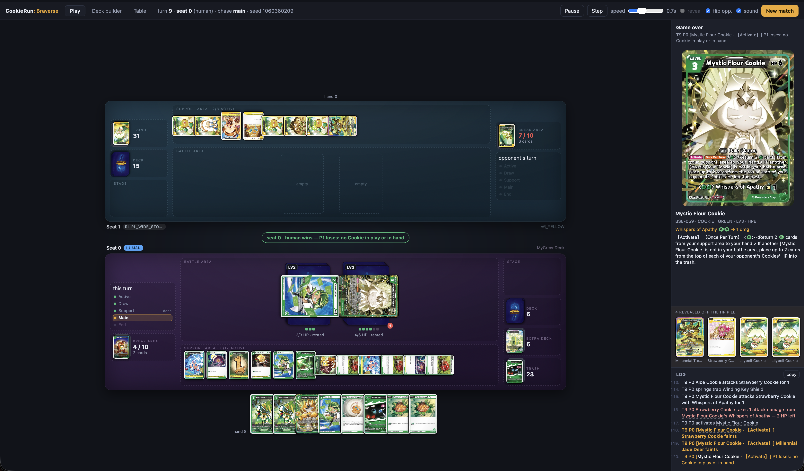

# Cookie Run: Braverse Simulator

Current Version: 0.2.36

[Cookie Run: Braverse Website](https://cookierunbraverse.com/en)

Example Image(s):


A rules engine for CookieRun: Braverse plus a practice bot to play against. This is an **unofficial** project and much of the code was generated using Claude (I feel like this should be explicityly disclosed). However, this was initially to create an simulator for deck building and agent training.

If there are any issues (as I'm sure there will be), please create an issue or message me on discord: \_\_set\_\_. 

I am a Python programmer specializing in ML, so game development is not my forte and thus please excuse some more amateur attempts at design in this project. This is just for fun and with my downtime. I am also a very new CookieRun: Braverse player so I know the rules in this sim are not perfectly implemented.

## Roadmap

There are many things that are still needing to be updated and reworked, but I intend to get more feedback and critical features moving forward. Below are some of the things I'm considering in no particular order:

- Adding multiplayer. Of course TCG games are nothing without community and so this feature is one of my top priorities.

- Introducing customizability for sleeves and mats. Right now the placeholder images are a bit ugly and I'd like to make the game feel more fun.

- There is code to ensure we allow for as many cards as possible, however the newer sets have cards that are still missing and so this needs to be fixed.

- I would like to add a deck builder to this implementation. I think text base deck building can be easy to implement but is not as fun and requires more work.

- Better animations and sounds. This bit is lacking and I know this needs to be improved to make the gameplay more enjoyable.

- Further simplifying the installation and running of the game. I know that running python code is not most people's favorite way of launching a program so I would like to fix that asap.

### Contents

- [Cookie Run: Braverse Simulator](#cookie-run-braverse-simulator)
  - [Roadmap](#roadmap)
    - [Contents](#contents)
  - [Repository layout](#repository-layout)
  - [Install](#install)
    - [Card art](#card-art)
    - [A standalone executable](#a-standalone-executable)
  - [Quick start](#quick-start)
  - [What works](#what-works)
    - [A move you are offered is a move that does something](#a-move-you-are-offered-is-a-move-that-does-something)
  - [The visual player](#the-visual-player)
    - [Learn: the guided first game](#learn-the-guided-first-game)
    - [A misclick is not a move](#a-misclick-is-not-a-move)
    - [Playing someone else](#playing-someone-else)
    - [The deck builder tab](#the-deck-builder-tab)
    - [Watching a game back](#watching-a-game-back)
    - [Your profile, and what it keeps](#your-profile-and-what-it-keeps)
  - [The effect compiler](#the-effect-compiler)
    - [The log says how much damage landed, and what dealt it](#the-log-says-how-much-damage-landed-and-what-dealt-it)
    - ["HP cannot reach 0" does not stop the damage](#hp-cannot-reach-0-does-not-stop-the-damage)
    - [The mulligan](#the-mulligan)
    - [One card turned is one point of damage](#one-card-turned-is-one-point-of-damage)
    - [A sprung trap owns the middle of the table](#a-sprung-trap-owns-the-middle-of-the-table)
    - [A Cookie lands rather than appears](#a-cookie-lands-rather-than-appears)
    - [Reveals are recorded as the card turns](#reveals-are-recorded-as-the-card-turns)
    - [Healing is cards, not a bigger Cookie](#healing-is-cards-not-a-bigger-cookie)
    - [A trap or a block, not both — and a block that costs a rest](#a-trap-or-a-block-not-both--and-a-block-that-costs-a-rest)
    - [Removal that skips the break area](#removal-that-skips-the-break-area)
    - ["This Cookie" on a FLIP is the card, not its host](#this-cookie-on-a-flip-is-the-card-not-its-host)
    - [Who goes first](#who-goes-first)
    - [Costs in angle brackets are a decision](#costs-in-angle-brackets-are-a-decision)
    - ["Up to N" is a choice of which, and of how many](#up-to-n-is-a-choice-of-which-and-of-how-many)
    - [【Your Turn】 is a condition, and a static ability can drop it](#your-turn-is-a-condition-and-a-static-ability-can-drop-it)
    - [A card filter cannot describe a card's state](#a-card-filter-cannot-describe-a-cards-state)
    - [The EXTRA deck](#the-extra-deck)
  - [Rules fidelity](#rules-fidelity)
  - [Self-play RL](#self-play-rl)
  - [Deck generation](#deck-generation)
    - [Not overfitting the shuffles](#not-overfitting-the-shuffles)
    - [Using the RL agent as the pilot](#using-the-rl-agent-as-the-pilot)
    - [Co-evolution](#co-evolution)
  - [Extending it](#extending-it)
  - [Source](#source)

## Repository layout

```
fetch_cards.py        downloads the card database from DotGG -> braverse_cards.csv
braverse/             the engine (library, UI-agnostic)
  cards.py            CSV -> typed CardDef, with the dump's typos normalised
  cost.py             {B}{B}{N} cost parsing and support-area payment
  state.py            zones, Cookies, GameState (plain data, deep-copyable)
  engine.py           phases, legal actions, combat, win conditions
  effects.py          the trigger registry and the vocabulary effects are written in
  effect_ir.py        effect IR + interpreter (ops, conditions, targets)
  compiler.py         rules text -> effect IR, for the bulk of the pool
  impl/               hand-written card effects, one module per set
  agents.py           RandomAgent, HeuristicAgent
  features.py         (state, action) encoding for learning agents
  rl.py               self-play RL: policy net, league, REINFORCE trainer
  deckgen.py          evolutionary deck generation
  decks.py            starter decklists + deck validation
  rps.py              the opening rock-paper-scissors for turn order
  replay.py           recording a game as its decisions, and playing it back
  config.py           every tunable rule, cited to the PLAY GUIDE
play_server.py        the visual player: play a bot, play a person, or watch two bots
viewer/               its browser front end (no build step, no dependencies, no assets)
                        app.js/style.css the table, builder.* the deck builder,
                        table.* the sleeve and playmat tab,
                        replays.* the replay shelf
selfplay.py           bulk self-play harness and win-rate report
train_rl.py           train / evaluate the RL agent
evolve_deck.py        evolve a decklist against a gauntlet
coverage_report.py    which cards the engine can play, and what to build next
coevolve.py           alternate deck evolution and agent training
compare_decks.py      round-robin decks under a chosen pilot
tests/                386 tests
requirements-play.txt just play the game (numpy only)
requirements.txt      the above plus RL, tests and tooling
```

## Install

**Python 3.9 or newer.** Check what you have:

```bash
python3 --version
```

If that errors, or prints something older than 3.9, install Python:

- **macOS** — `brew install python@3.12`, or the installer from
  [python.org/downloads](https://www.python.org/downloads/). The `python3` that
  ships with macOS works too if it is 3.9+.
- **Windows** — `winget install Python.Python.3.12`, or the installer from
  [python.org/downloads](https://www.python.org/downloads/); tick **Add
  python.exe to PATH**. Use `python` instead of `python3` in every command
  below.
- **Linux** — `sudo apt install python3 python3-venv python3-pip` (Debian /
  Ubuntu) or `sudo dnf install python3 python3-pip` (Fedora).

Then clone the repo and set up a virtual environment:

```bash
git clone https://github.com/<you>/cookie_run_simulator.git
cd cookie_run_simulator
python3 -m venv .venv
source .venv/bin/activate
```

On Windows the last line is `.venv\Scripts\activate` instead.

Then pick one of the two dependency sets.

**Just to play the game** — this is the one you want if you came here to sit
down and play a match. One small package, no PyTorch, a few seconds to install:

```bash
pip install -r requirements-play.txt
python play_server.py
```

That opens the game in its own window if it can (see
[Its own window](#its-own-window)) and in a browser tab otherwise.

That covers the whole game: the engine, the player against the
`heuristic` and `random` bots, `selfplay.py`, `evolve_deck.py`,
`compare_decks.py` and `coverage_report.py`. The only dependency is `numpy`,
which `braverse.features` imports. The browser front end has no build step and
no dependencies of its own — no npm, no bundler.

The one thing you give up is the RL pilots: the `rl_agent*.pt` checkpoints will
not be selectable as opponents in the visual player, and `train_rl.py` /
`coevolve.py` will not run. Everything else behaves identically.

**Everything, including the RL** — training, co-evolution, the test suite and
the Tabletop Simulator exporter. This pulls in PyTorch, so it is a few hundred
MB:

```bash
pip install -r requirements.txt
```

| Package  | In which file            | Needed by                                          |
| -------- | ------------------------ | -------------------------------------------------- |
| `numpy`  | `requirements-play.txt`  | required — `braverse.features`, imported by the package itself |
| `torch`  | `requirements.txt`       | `braverse.rl`, `train_rl.py`, `coevolve.py`, RL pilots in the visual player, `tests/test_learning.py` |
| `tqdm`   | `requirements.txt`       | progress bars in `train_rl.py` / `coevolve.py`     |
| `pytest` | `requirements.txt`       | running `tests/`                                    |
| `pillow` | `requirements.txt`       | `build_tts_sheets.py` (Tabletop Simulator sheets)  |

`requirements.txt` includes `requirements-play.txt`, so it is the superset —
never install both.

### Card art

The card database `braverse_cards.csv` is checked in, but the ~2000 card images
are not — they are 190 MB and belong to Devsisters, not this repo. Download
them once:

```bash
python3 fetch_images.py            # everything -> card_images/
python3 fetch_images.py --sets ST8 ST9   # just the two starter decks (fast)
```

It skips files it already has, so it is safe to interrupt and re-run. Without
them the visual player still works — cards just render as name plates instead
of art.

To refresh the card database itself: `python3 fetch_cards.py`.

### A standalone executable

`braverse.spec` builds the visual player into one self-contained binary — no
Python, no virtualenv, no `card_images/` checkout on the machine that runs it.
Hand someone the file, they double-click it, the browser opens:

```bash
python3 fetch_images.py             # the art goes inside the binary
python3 build_release.py            # -> release/braverse-<version>-macos-arm64.zip
```

The zip holds three files: the game, an installer, and a read-me. The game runs
from wherever it is put — the installer exists because *where it is put* is
where the game keeps things.

```bash
./install-braverse                  # asks where, then whether to make a shortcut
./install-braverse --uninstall      # removes the program, keeps decks and profiles
```

It copies the game into a folder the player owns (`%LOCALAPPDATA%\Braverse`,
`~/Applications/Braverse`, `~/.local/share/braverse` — never Program Files or
`/Applications`, because the game writes beside its executable and those are
read-only to the person playing), creates `decks/`, `card_images/`, `profiles/`
and `replays/` with a read-me in each saying what belongs there, and offers a
shortcut: a Start Menu `.lnk` on Windows, a small `.app` in `~/Applications` on
macOS — a launcher, not a copy, so an upgrade does not orphan it. Both set the
working directory to the install folder, since that is what decides where the
game saves. On macOS it also clears `com.apple.quarantine` from the copy it
installs, which is the difference between the game opening and Gatekeeper
refusing an unsigned binary outright.

Installing again over the same folder replaces only the program: that is the
upgrade path, and why the installed binary is named `braverse` and not after a
version. `--uninstall` leaves decks, profiles and replays where they are, and
says so; `--purge` is how you ask for the other thing.

`build_release.py` is the whole build: it checks the art library is complete,
makes a throwaway `.venv-build/` holding `requirements-play.txt` and
PyInstaller and *nothing else* — so there is no torch on the path for
PyInstaller to find, rather than merely excluding it — runs the spec, proves
the binary starts (`--help` imports everything the game needs), and zips it
with a README naming the platform it was built for and the first-launch prompt
that platform shows. `--no-images` builds without the art (11 MB rather than
208, cards render as text), `--webview` bundles the native-window backend,
`--no-venv` skips the venv and uses the current interpreter, which is faster
and only as lean as that interpreter is, and `--no-installer` ships the game
alone. On macOS it bundles pywebview by default — about 2 MB frozen, and the
difference between the game having its own WebKit window and it *launching
Google Chrome*, which is what `desktop.py` falls back to when there is no
backend to draw with. `--no-webview` opts out; `--webview` opts in on Windows,
where it is off by default because pywebview needs pythonnet to reach WebView2
and the frozen combination is untested — and where the fallback is a chromeless
Edge window that ships with the OS. A bundled backend that turns out not to run
is not fatal: `open_window` says so and uses the browser window. The spec still builds on its own:

```bash
pip install pyinstaller
pyinstaller braverse.spec           # -> dist/braverse  (208 MB)
```

It carries the engine, the browser front end, `braverse_cards.csv`, the
decklists and the **whole ~2000-card art library**, so any deck of any cards
renders. Art in a `card_images/` folder beside the binary is used in preference
to the bundled copy (`play_server.card_image`) — the library is baked in and
`fetch_images.py` is not in the bundle, so that folder is the only way a card
printed after the build gets a picture. Drop a decklist `.txt` next to the binary and it shows up in the deck
menu — that is how a card outside the shipped decks gets played, and why the
art is bundled whole. A `.txt` beside the binary overrides a bundled one of the
same name. The spec refuses to build against a thin `card_images/`.

It leaves out the RL pilots, because torch would add about a gigabyte — the
pilot menu is human / heuristic / random. A `.pt` beside the binary is picked
up the same way decklists are, but still needs torch present to load.

The size is paid at every launch, not just once: a one-file bundle unpacks
itself into a temp directory each run, which is **about 6 seconds** before the
browser opens. If that grates, build a folder instead — flip `onefile=True` to
`False` in the spec, zip `dist/braverse/`, and it starts instantly.

PyInstaller does not cross-compile: build it on macOS and you get a macOS
arm64 binary, build it on Windows for a `.exe`. Unsigned binaries need one
right-click → **Open** on macOS the first time. To get both platforms out of
one command, `.github/workflows/build player` runs `build_release.py` on a
macOS runner and a Windows one — from the Actions tab (with a checkbox for
whether to fetch and bundle the art), or automatically on a `v*` tag, which
also drafts a release with both zips attached.

## Quick start

If you installed the full `requirements.txt`, run the tests to confirm it
(157 tests, about 30 seconds — they need `pytest`, and `test_learning.py` needs
`torch`):

```bash
python -m pytest -q tests/
```

Play 200 games of bot-vs-bot and print the win rates:

```bash
python selfplay.py -n 200
```

Drive the engine yourself:

```python
from braverse import Game, HeuristicAgent, SeatedAgent, STARTER_DECKS

agents = [SeatedAgent(HeuristicAgent(), 0), SeatedAgent(HeuristicAgent(), 1)]
game = Game([STARTER_DECKS["st9_sea_fairy"], STARTER_DECKS["st8_wind_archer"]],
            agents, seed=1)
game.setup()
while not game.state.over:
    options = game.legal_actions()
    seat = game.to_move()
    game.step(game.controller(seat).choose_action(game.state, options))
print(game.state.win_reason)
```

Or play a game yourself in the browser:

```bash
python play_server.py
```

Opens a board at `http://localhost:8080` — see [The visual player](#the-visual-player).

`legal_actions()` returns fully-specified moves (targets included) and
`game.clone()` gives an independent deep copy, so a search agent can be dropped
in without touching the engine.

## What works

- Full turn structure: active → draw → support → main → end.
- Support area as energy, coloured and generic (`{N}`) costs, resting to pay.
- Cookies played free from hand with a face-down HP pile drawn off the deck.
- Damage flips HP cards into the trash; FLIP cards fire on reveal.
- Fainting, the break area, [refresh], and both loss conditions.
- 【On Play】, 【Activate】, 【Once Per Turn】, 【Blocker】, attack riders, FLIP
  effects, faint triggers, Items, Traps (with a real defender response window),
  and Stages.
- The **EXTRA deck**, including 【Awaken】: a second pile of at most 6 cards,
  never drawn, each played through the gate printed on it.
- Both ST8 and ST9 starter decks are fully implemented and legal.

- **1393 of 1540 cards are fully playable**: 225 hand-written, 967 compiled
  from their printed text, 201 genuinely vanilla. `coverage_report.py` shows
  the split.
- **7 of 22 sets are 100% implemented** — ST6–ST10 plus BS8 and BS10. The 147
  cards still outstanding rest on mechanics the engine does not model —
  【Special Play】, 【Equip】, and replacement effects that rewrite an opponent's
  abilities — plus a tail of ITEM/TRAP/STAGE text that needs new compiler
  grammar.

### A move you are offered is a move that does something

The action list used to answer "can this be paid for?" and stop there, so a card
whose condition was false, whose target was not on the board, or whose
`<Discard 3 cards.>` you could not cover was still offered as a move. Taking it
spent the card and produced nothing. That is the engine asserting something
untrue about the position, which is worse than a missing convenience.

Every effect is now asked whether it would accomplish anything before its move
is listed. A compiled card answers for itself — its `If ...,` clauses are
`Guard` ops and its targets are `Select` ops, both of which the engine can read
without running them. A hand-written body is opaque Python, so it declares the
same thing with `@playable_if`, which is the `if` at the top of the function
hoisted to where the action list can see it. Anything that answers neither way
stays on offer: **wrongly hiding a card is the worse failure**, because a card
that is missing cannot be argued with, and a card with no implementation at all
is the engine's gap rather than something the rules say.

Two details decide whether this is right or merely close:

- The probe reads the board and never touches it. A rehearsal on a clone would
  answer more questions and cost a deep copy per candidate move per turn.
- An item is still in your hand while the list is built and gone from it by the
  time it resolves, so "if there are 5 cards or less in your hand" and
  `<Discard 3 cards.>` are both read against the hand *minus the card being
  played*. Off by one here hides live cards, which is the failure that matters.

Across 200 starter-deck self-play games this suppresses **5476 moves** and the
results are bit-identical — 179/200, the same mean turn count, the same
outcomes. The scripted bot was never taking those moves, because a move that
does nothing scores nothing. They were only ever shown to a person.

The cost is about 15% of raw simulation throughput (188 → 179 games/s on the
starters), paid on every `legal_actions()` call.

Cards whose text the compiler does not fully understand stay vanilla and are
kept out of the generated deck pools. `coverage_report.py` shows exactly where
that line falls.

## The visual player

```bash
python play_server.py            # --port 8080 --no-browser
python play_server.py --lan      # also reachable from the rest of the network
python play_server.py --browser  # a browser tab instead of a window
```

Stop it with ctrl-c, or by closing the window. It also shuts down on SIGHUP and SIGTERM, so closing the
terminal takes the server with it rather than leaving something holding port
8080; if the port is busy anyway it names the PID still on it.

### Its own window

It plays as a desktop game, not a tab: no address bar, no tabs, and closing the
window ends the process. Under it nothing changed — the same local HTTP server
and the same `viewer/` — because that server is also what makes two people on
one network play each other, and a window that spoke some other protocol would
have meant two front ends to keep in step.

`desktop.py` picks who draws the window, best first:

- **pywebview** (`pip install pywebview`), a real native window drawn by the
  OS web view: WebKit on macOS, WebView2 on Windows, WebKitGTK on Linux.
- **Chrome, Edge, Brave or Chromium in app mode** (`--app=`), if one is
  installed. Same chromeless window without the extra install. It gets a
  profile directory of its own under the user cache, because launching Chrome
  while Chrome is already running otherwise just hands the URL to the running
  copy and exits — which would look like the window shutting the game down the
  instant it opened.

Neither available means a browser tab, as before. `--window` insists on a real
window and says what to install rather than falling back; `--browser` forces the
tab, which is what you want when debugging the front end, since devtools come
with it. `--no-browser` still serves and opens nothing — that is the mode the
preview harness and `--lan` hosting use.

The window owns the main thread — every OS web view requires that — so in this
mode the HTTP server runs on a thread and the window is what the process waits
on. ctrl-c closes the window too, rather than leaving one showing a board whose
server has gone.

### Windows

Everything runs on Windows, macOS and Linux from the same checkout — the engine
was always pure Python, and the parts that were not portable were the edges
where the *player* touches the operating system:

- **Signals.** Windows has no `SIGHUP`, and asking `signal` for it by name is an
  AttributeError before the first card is dealt. The shutdown handler now
  installs whatever signals the platform actually defines, `SIGBREAK` included.
- **Content types.** `mimetypes` reads the registry on Windows, which routinely
  calls `.js` `text/plain` — served under that type the front end is a blank
  page with no clue why. The types for everything in `viewer/` are now ours, and
  a test fails if a file appears there with an extension not in the table.
- **Text files.** The default encoding on Windows is cp1252, which cannot
  represent card names, `【 】`, or the em dashes the server prints. Every
  decklist, replay and save file is read and written as UTF-8, and written with
  LF endings, so a deck built on Windows is byte-identical to one built on a Mac
  and can be mailed to either. Redirected output is retuned to UTF-8 too
  (`braverse/console.py`, called from every script's `main`), since
  `play_server.py > log.txt` — or an overnight `coevolve.py` run writing a log —
  would otherwise die on the first card name it printed.
- **Ports.** `SO_REUSEADDR` on Windows does not mean "reuse after TIME_WAIT", it
  means "bind a port someone else is already listening on", which would split
  requests between two servers; it is off there, so a busy port says so. The
  "who has the port" message reads `netstat -ano` instead of `lsof` and offers
  `taskkill` instead of `kill`.
- **Writable directories.** `os.access(dir, W_OK)` is always true on Windows, so
  a copy installed under Program Files looked writable and then failed when it
  tried to save. Replays and saved decks now probe by creating a file, and fall
  back to `%USERPROFILE%\.braverse` when they cannot.
- **The window.** pywebview uses WebView2, which ships with Windows 10 and 11.
  Failing that, Chrome, Edge, Brave and Chromium are looked for under both
  install roots — per-machine under Program Files and per-user under
  `%LOCALAPPDATA%`, both of which are ordinary depending on who ran the
  installer.

```powershell
py -m venv .venv
.venv\Scripts\activate
pip install -r requirements-play.txt
pip install pywebview        # optional: a native window instead of a tab
py play_server.py
```

`py build_release.py` builds `release\braverse-<version>-windows-x86_64.zip`
there, the same way it builds a macOS binary on macOS — the `.exe` inside is
the only thing a player needs.

`tests/test_windows.py` covers each of these by faking the platform, so a Mac or
Linux `pytest -q` still catches a regression in the Windows path. What it cannot
do is prove the whole game runs there — that needs a Windows machine. The
`run_coevolve_*.sh` helper scripts are still shell scripts, and are for training
runs, not for playing.

A playmat with the printed card art. Cards in the battle area are drawn larger
than the ones in a support row, because that is where the game is actually read;
every stand-in overlay — the flip reveal, the break, the skill popup — sizes
itself off the same two CSS variables, so they cannot drift apart. On a short
window the board scrolls: it used to be a grid whose rows got fitted to the
container, which squeezed the mats until they overlapped each other.

The board shows the two battle areas with their face-down
HP piles, the support area, the stage, deck and trash, the break-area clock, and
both hands. Pick a pilot and a deck for each seat — `human`, `heuristic`,
`random`, or any `rl_agent*.pt` checkpoint in the directory — plus any decklist
`evolve_deck.py` has written. Two bots means spectating, with pause,
single-step, and a speed slider; a `human` seat means you play that side.

**Click a card and it tells you what it can do — and that is the whole move
list.** The menu names that card's legal moves the way the card prints them —
"Bike Blast", "Tracker's Arrow" — because 980 of the Cookies name their attack.
The 220 that use the older `<{P}{P}> Deals 2 damage.` printing have no name to
show, and no 【Activate】 skill in the whole pool is named, so those fall back
to the marker itself: "Attack" and "Activate". An attack gets one row per legal
target, so choosing what to hit and choosing to swing are the same click.

There *was* a list of every legal action stacked down the right-hand side, and
it was the biggest thing on screen. It was also the least pleasant part of the
game: it named cards you were already looking at, it grew to twenty rows on a
busy turn, and it took the space the card you were hovering should have had. It
is gone. What replaced it is three things working together:

- **The cards say what they can do.** A card with something in its menu carries
  a thin cool ring. A card the game has *stopped for* — a trap you can spring, a
  Cookie you can block with, the Cookie an effect is pointing at — is louder:
  green, pulsing, and raised out of the hand. Two volumes, and keeping them
  apart is the point. On a good turn most of your hand is playable, so if
  "playable" and "the game is waiting on you" looked the same, neither would
  mean anything.
- **Clicking a card opens its menu**, on either side of the table. Unless the
  question already names that card, in which case the first click answers it —
  "damage which Cookie?" should not make you open a menu to say "that one".
- **Whatever has no card to point at goes in the middle of the table**, between
  the two mats: End turn, Pass, an 【EXTRA】 played standalone out of its pile,
  a banked rider that was never a card on the board.

Which moves land in that middle tray is decided from the finished markup, not
from a list of kinds: an option is homeless when nothing on screen carries its
uid *and is clickable*. Those last three words matter — a face-up pile draws its
top card with a real uid on it, but the pile's layers are inert, so "there is a
node with that uid" was not the same question as "you can click it". The two
now come from the same line of code. A move nobody anticipated therefore lands
in the tray rather than quietly becoming unplayable, which is the one failure
this layout could otherwise have had.

The panel on the right keeps the prompt, one line saying where to click, and the
log. Everything the move list was using now belongs to the card viewer.

**The round, above the break area.** A strip on each mat shows Active → Draw →
Support → Main → End, lit for whoever's turn it is and dimmed on the other side.

It deliberately reads more than `state.phase`, because that field alone would be
a lie by omission: the engine only ever *reports* `main` to a player — it untaps
and draws inside the turn machinery, and never enters `support` at all, since
placing a support card is a main-phase action capped at one per turn rather than
a phase you stop in. So Active and Draw show as already resolved (and Draw reads
*skipped* for whoever opened, who forgoes their first draw), End as still to
come, and Support carries the one thing you can still act on.

**The support step.** A pulsing dot was the first version of that nudge, and it
was one you could play straight past — forgetting the free support card is the
easiest mistake in the game, and a hint you are allowed to ignore is a hint most
people do ignore. So the viewer puts the step back in and *stops* on it. Your
turn opens with the move list narrowed to "place a card as support", the panel
and banner asking for one, Support lit **now** and Main greyed out behind it. The
way out is to place a card or to press **Pass to main phase**, after which the
full turn returns and Support reads *passed* rather than *ready*. Placing one
reads *done*, as before.

None of that reaches the engine. The support step is a second question asked
over the *same* action list `choose_action` already published — every option in
it was legal a moment ago and the ones hidden come back untouched — so it is a
viewer-side reordering of how a human is asked, not a rules change. Bot seats,
`selfplay.py` and the training loops never see it, and self-play win rates are
unmoved by it. The one thing the server contributes is a `turnAction` flag on
the pending question, so the browser can tell the turn's own move list apart
from a mid-effect question; passing is remembered per turn and per browser and
resets itself when the turn number and turn player change.

Passing is not binding on the engine, and deliberately so: if you pass and then
change your mind, the card's menu still offers **Place as support** for the rest
of your turn. The step is there to make the decision happen, not to take the
move away.

**Questions about cards are answered by pointing at cards.** When an effect
asks which Cookie to damage or debuff, the candidates light up on the board and
you click the one you mean. The same goes for a card in your support area. Cards
you *cannot* reach on the table — in your hand, trash, break area or deck — come
up as a strip instead, which is decided structurally rather than by prompt text.

That worked on your opponent's half and, for a long time, nowhere else. Your own
cards are *dragged* to play them, so they carried a pointerdown handler and no
click handler at all — and "select up to 1 of your Cookies", one of the most
common clauses in the pool, could only be answered from the list in the far
corner while the Cookie sat right there on the board. Both sides run the same
handler now: a question that names the card answers with it, and anything else
opens the card's menu. A drag that ends over its own card fires a click too,
which is ignored for a quarter-second afterwards. A "pick N of these" question
is never answered this way — that one is a batch, and a single index sent to it
gets padded out by the engine with cards nobody chose; it gets the strip, and
since there is no list left to decline from, the strip carries its own
**Decline**.

**The opening Cookie is picked out of your hand, not off a list.** It was the
one hand question with a genuinely short answer — three or four Cookies in a fan
of six cards — and a strip laid the same three cards out a second time, below a
list naming them a third. The eligible Cookies now stand up out of the hand and
glow, which is exactly the treatment an armed trap gets during an attack window,
and a click plays one. `hand_pick` returns `None` for that prompt so no strip is
built, and the panel says where to click instead of listing the answers. The
gesture is the same `directOption` path your own board Cookies already use, so
nothing new can be clicked that was not already legal; a hand card with no drop
target does not start a drag, so the click has the card to itself.

**A yes/no is asked in the middle of the table.** `Ctx.confirm` and every
optional `<...>` cost are one button and a decline, and they were rendering as a
one-item list in the far corner while the thing being asked about was in the
middle of the board. `centre_style` returns `yesno` for a question whose options
are all booleans, and the decline travels with it — a yes/no is only half a
question without the no.

**Energy is drawn, not spelled.** Rules text writes it as `{G}`, and so does
every prompt, option label and attack line built out of that text; `<{G}{G}>`
is not a cost anyone reads at a glance. Each token is now the coloured gem the
card prints, letter included — six shades are a lot to tell apart at 11px, and
some people cannot tell two of them apart at any size. The substitution lives in
`h`, the one function every piece of text in the viewer is built with, because a
version that covered only some of the places these tokens appear would be worse
than none: the reader stops trusting which is which. The deck builder shares
that function, so it came along for free.

**The card back is yours to supply.** The CDN behind `fetch_images.py` serves
card *fronts*, keyed on card id; it has nothing for the reverse, and neither
does anywhere else this project can reasonably fetch from. So the viewer draws
its own sleeve — that is what the Table tab is full of — and looks for
`card_images/card_back.webp` on the way up. Put the real thing there and every
face-down card on the board uses it, with the drawn sleeve as the fallback for
anyone who has not. `python fetch_images.py --card-back <url-or-path>` will put
it there from a URL or a local file. It is probed once rather than per card,
and the image stays out of the repo the same way all the other card art does.

**A face-up pile shows a face-up pile.** The trash, the break area and the
EXTRA deck are public, so each draws its top card face up on a stack three deep.
The two cards underneath were drawn as full card *backs*, offset up and to the
right — so the right-hand sliver of a face-up pile was a face-down sleeve, and
pointing at that edge showed nothing and looked like the pile was face down.
Underneath a face-up top card they are paper edges now, with no sleeve on them,
and the layers are inert: the pile itself owns the hover, so anywhere you point
at it — including the sliver — previews the top card. The deck keeps its backs,
because that one really is face down.

**Questions about your hand are answered with your hand.** Discarding, opening
with a Cookie, fielding a replacement when one faints — all the same gesture:
your hand comes up as a strip, you toggle up to the number asked for, and the
confirm button says what you are about to do (*Discard*, *Play Cookie*).
Choosing from a list on the far side of the screen while your hand sits at the
bottom was the wrong way round. With one card to pick, clicking a second moves
the choice rather than refusing it.

Which questions get the strip is decided structurally — every option is a card
that is in your hand — rather than by matching prompt text, so a new prompt of
the same shape gets it for free; only the verb reads from the prompt.

That needed one engine change. `Game.discard` asked its controller once *per
card*, which is the natural shape for a greedy bot and the wrong shape for a
person. `effects.ask_many` now asks a controller that implements `choose_many`
for the whole selection in one question and loops `choose` for everyone else —
so every scripted agent behaves exactly as before, bit for bit, and only the
human seat sees the difference. It also normalises a short, padded or repeated
answer, because "discard 2" has to remove exactly two cards however the client
phrases it.

**Sleeves and playmats, per seat.** The **Table** tab picks a card back and a
felt for each side, the way a kit belongs to a player rather than to a chair.
Everything is drawn in CSS — gradients, not image files — for the same reason
the rest of the front end has no assets: the viewer stays a folder of text, and
the one-file build does not grow by a megabyte per sleeve.

The choice is written to `<body>` as `-me-` / `-opp-` custom properties, which
`style.css` maps onto `.side.me` and `.side.opponent`. That one indirection is
what lets the kit survive a re-render, a seat swap and a refresh without any of
the board code knowing the tab exists — and it has to be variables rather than
classes, because `seatPerspective` decides which section is which by
overwriting `className`. Every sample in the tab is the real thing at a smaller
size: a swatch is an actual `.card.back`, a mat sample is the actual mat
background, so a preview cannot drift from the table it previews.

A mat carries its dashed zone outlines and label colour with it, since a pale
felt wearing the dark felt's outlines is unreadable. The two seats start on
different sleeves, because telling your cards from your opponent's at a glance
is what sleeving them is for.

**Traps stand up when they can be sprung.** A response window is the one moment
your hand can act on someone else's turn, and the only card in it that can act
is a trap you can pay for. Those rise out of the hand with a green ring; the
rest stay flush. Finding out which of six cards was live meant clicking through
all six, during the one decision in the game that is genuinely time-shaped.

**Drag and drop.** Pick up one of your cards and the legal drops light up:
a Cookie card onto your battle area to play it, any card onto your support area
to place it, one of your Cookies onto an enemy Cookie to attack it. Dropping
somewhere illegal does nothing, and a drag that goes nowhere falls back to
being a click.

Dragging is only ever a second way to name an option the server already sent:
a drop resolves to (subject, target) and then looks for the one legal action
that matches, so the drag layer cannot invent a move the engine did not offer.
When an effect asks a question mid-resolution — "Damage which Cookie?" — the
cards it is choosing between are outlined and clicking one answers it.

**End turn** sits in the middle of the table, next to the turn banner, as well
as at the end of the move list — it is the move you reach for most and the far
corner of the screen is the worst place for it.

Hover any card for its full text. It appears in the panel on the right rather
than under the cursor: an enlargement that follows the mouse covers the thing
you leaned in to look at, and hovering a Cookie in your own battle area used to
paint over the row it was standing in. That panel is now the largest thing in
the column, and **everything that names a card feeds it** — a card on the table,
a row in a card's menu, a button in the middle of the table, and every card name
in the log. One place to look, whatever you pointed at.

The deck builder and the full-screen deck view have no panel to dock to and keep
the cursor-following version; so does the trash/break browser, where the preview
paints over the dialog rather than behind it — a modal `<dialog>` lives in the
browser's top layer, which no z-index can beat, so the preview moves inside it
while it is open.

Click a card for the menu of what it can do; click the trash or break area to
search through it. Keys `1`–`9` take a row from an open card menu, or a button
from the middle of the table when no menu is open, and `space` / `→` pause and
step. `reveal`
shows both hands, and is a spectator's tool only: in a match you are playing it
is disabled and ignored, so your opponent's hand stays hidden however the
request is made.

`flip opp.` (on by default, remembered per browser) turns the opponent's half
through a full 180°, the way their mat would sit across the table from you:
rows swap so their support area is above their battle area, columns swap, each
column's contents reverse — so their stage, deck and trash mirror yours across
the centre line — and their cards face them, so you see the art upside down. A
rested card of theirs sits at 270° rather than 90°, for the same reason. Zone
labels, counters and the reveal animation stay upright, because those are the
interface rather than the board; hover any card to read it the right way up.
Turn the option off to see both halves in the same orientation.

**Cards turn, they do not snap.** Resting to attack or to pay a cost, and the
sweep back to active at the start of your turn, are animated in both directions
— staggered slightly when a whole support row untaps at once. The board is
rebuilt from scratch on every commit, so a CSS transition has nothing to move
*from*; the renderer remembers how each card sat last time it was drawn, starts
the new node at that angle and lets it turn to the one the stylesheet asks for.
The reset to the stylesheet's own transform is on a timer rather than the
animation's end, because a backgrounded tab never fires the frame that would
start it, and a card must never be left lying at the wrong angle.

**Cards are dealt, not conjured.** A draw sends a face-down card arcing from
that player's deck to their hand before the hand redraws underneath it. The
event carries a *count* and nothing else — a drawn card is secret, so there is
no identity to send and nothing to leak — and it is told apart from a card
arriving in hand some other way (a Cookie bounced off the board) by pairing the
arrivals against how far the deck actually fell.

**Actions play out.** One action can be a whole little scene, and the browser
plays it as a sequence: the attacker steps out of its slot, turns side-on
alongside the Cookie it is hitting and settles back; the defender takes the hit
and shakes; damage turns HP cards face up; a Cookie that breaks snaps in two
along a jagged seam and the halves fall apart. Both halves carry the whole card
art, each clipped to one side of the *same* randomly generated polygon, so the
crack matches tooth for tooth and no two breaks look alike. `sound` (on by default) adds card flicks, the swing and its impact,
and a crunch when a Cookie breaks — all synthesised with WebAudio at play time,
so there are no audio files to ship and nothing to download. Browsers will not
start audio without a user gesture, so the first click or key press unlocks it.

The attack comes from the *action*, not a state diff — an attack is a thing a
player did, and by the time it resolves the target may be off the board
entirely — while faints come from a diff of the battle area, which catches
"placed in the trash" and effect bounces as well as ordinary fainting, and marks
which of them actually banked Level in the break area.

**The board is deliberately a beat behind the server.** Events describe what an
action *did*, so they have to be animated against the board as it was before
it: the attacker must lunge at a Cookie that is still standing, and an HP card
must turn face up over the pile it came off. Rendering the new state first left
the attacker swinging at an empty slot every time it killed something. So the
browser plays the scene, *then* commits the state, holding the newest snapshot
until it finishes and refusing clicks in the meantime — an option index from the
old list would answer the question the server has since moved on to. The bot
seats wait out the same scene, so nothing happens off screen: the pause is
computed from the events themselves (`scene_seconds`) rather than being a fixed
beat, and is capped so a pathological batch cannot stall the match. It counts
each animation through to its *end* rather than its start — a bot must not move
again while a revealed card is still being read — so an attack that turns three
HP cards face up and breaks a Cookie holds the board for about six seconds.

**Damage is animated.** An HP card turning face up is the swing moment of a
battle — a FLIP fires the instant it is revealed — so each revealed card turns face up over the Cookie it came off
rather than a number quietly ticking down. It is held enlarged for about a
second and a half, which is the difference between seeing that something
happened and reading *what*, and the bot seats wait an extra beat after a reveal
so the board does not move on underneath it. The panel also keeps the last
reveal as a strip of thumbnails, so one you blinked through is still there —
worth having, because the log only records FLIPs, not ordinary HP cards.

That needs no engine callback: an HP card moves straight from the face-down pile
to the trash, so diffing those two zones between snapshots *is* the reveal, and
a card an effect bounces out of the pile correctly does not count. Two things
that bit, both now pinned by tests or comments: several `publish` calls can
share one game state, and diffing them against each other erased the reveal
before the browser polled it; and the obvious way to write the flip —
`backface-visibility` on a `rotateY` — is not honoured everywhere, so the card
stayed back-side up through the whole animation. It is a 2D squash-and-swap
instead.

### Learn: the guided first game

**Learn** in the header deals a real game and talks you through it. Not a
scripted board and not a slideshow: it POSTs the same `/api/new` the setup
dialog does and then watches the snapshot the viewer is already polling. Each
step names a *moment* ("it is your main phase and you have not placed a support
yet"), dims the board around the one zone it is about, and advances when the
game reaches the next one.

That the condition is on the board rather than on a script is the whole design.
A tutorial that drives the game has to be right about what you will do next, and
you will not do it: you will place the support before it asks, or attack with
the other Cookie, or lose the toss. So the coach never makes a move and never
blocks one — the veil is `pointer-events: none` throughout, because the card
menu is parked on `<body>` outside whatever rectangle is lit up, and a tutorial
that ate the click it had just asked for would be worse than none. Ignore it
entirely and it will catch up with you.

#### The one thing it cannot leave to chance

A course made of "wait for the player to do X" is only as good as X being
*possible*. "Play a Cookie into the empty slot" is a lie if the shuffle dealt no
second Cookie, and it does not matter how gracefully the step waits — the person
reading it has been given an instruction they cannot follow. So the tutorial
keeps the engine and replaces the two things that make a game unpredictable:

- **The deal.** `Game` takes `shuffle=False` and deals off the top of the list
  it was given. `braverse/tutorial.py` holds the lists, and they are the shipped
  starter decks *reordered* rather than new ones — the scripted opening lifted
  to the top and put back — so legality is by construction: a permutation of a
  legal deck is a legal deck. The opening six are a Cookie to open with, two
  Items to spend, the 【Blocker】 for the second slot, a Trap, and a cheap
  attacker; and because a stacked deck redraws off the top, the *next* six are
  the same hand in different cards, so someone who takes the free mulligan gets
  a second teachable hand rather than whatever sorted by id.
- **The opponent.** A controller like any other, with no RNG in it at all and a
  policy written as an order of preference rather than a score. Two of its rules
  are teaching decisions and not good play: it never lays more than **two
  supports**, and it swings **once a turn**. In ST8 everything that hits for 3
  costs three energy, so a bot that never reaches a third support cannot hit for
  more than 2 whatever it draws. Uncapped it opened a Leek Cookie and had the
  game by turn 9 against someone who was following the course. It also attacks
  the *sturdiest* Cookie rather than the weakest, which is what keeps the block
  lesson available: your 【Blocker】 is never itself the target, so stepping in
  front of the attack is always a move that exists.

Even the toss is settled without being rigged. The bot cycles its throw instead
of repeating one — a fixed throw ties forever against a player who keeps
throwing rock, and every tie is another unexplained "throw again" — and on the
rounds it wins it chooses to go *second*. The course is written from the opening
player's seat, and which way a coin landed is not something a tutorial should
reorder itself around.

Two more things keep it out of a corner. A step hung off a question that may
never be asked carries the evidence that its moment has been and gone — lose the
toss and "you won the toss" recognises that the toss is settled and steps aside.
And a step waiting on something the deal cannot guarantee has a **patience** in
turns, after which it gives up rather than holding the rest of the course behind
it.

Alongside the seventeen steps are four asides that fire the first time the game
asks something a new player has not met: a block, a trap window, a card-picking
strip, an optional `<...>` cost. They interrupt whatever step is up and hand it
back afterwards, so an aside can never cost you your place.

#### Tested by playing it

`tests/test_tutorial.py` walks the course's own path against a real `Game` and
asserts every moment it waits for actually arrives, in order: a support to
place, a Cookie for the empty slot, a turn that ends, an attack from the bot
with both a block and a trap in the response window, an attack of your own you
can pay for. It does it from each of the three opening throws, and again after
taking the mulligan, and checks the game is still alive at the end and that the
whole thing lands by turn 6 — a course that only completes on turn 20 is one
nobody is still reading by the time it does.

Three real faults came out of writing those tests, all of them ones a person
would have hit: the stall above; a deck ordered by id that dealt the bot three
Cookies it could not pay for once its cheap attacker died, leaving both players
passing at each other until the decks ran out (the remainder is ordered
cheapest-attack-first now); and a redraw that opened with the 【Blocker】 as its
biggest body, so the bot attacked it every turn and the block never once came
up.

The browser half is `viewer/tutorial.js` plus a stylesheet, and it touches
`app.js` in exactly two places: one line at the end of `render` to hand it the
snapshot, and one in `answer` to tell it which move you just chose — the option
list is gone by the time the answer lands, and "did they attack?" is not a
question the next board reliably answers. Since it is a viewer file, it is also
one the server has to be told about; `tests/test_viewer.py` reads `index.html`
and `do_GET` and fails if a script tag names a path the allowlist does not
serve.

### A misclick is not a move

There is no undo. The server owns the game, an answer sent is a move made, and
the two cheapest clicks on the table — pointing at a Cookie to answer "which
one?", and **End turn** — are also the two that hurt most when the pointer was
somewhere else. The fix could not be a confirmation dialog on everything: a turn
is a dozen answers, and a yes/no on each of them turns a game into paperwork.

So the viewer protects the moves you cannot take back, and only those.
`viewer/confirm.js` does two things:

**A settle guard.** The board redraws under the pointer every time a question is
answered, and a click already on its way lands on whatever moved into that spot.
Any answer sent within a quarter second of a *new* question appearing is dropped
with a one-line hint instead. It costs a correct click nothing, because nobody
reads a question and answers it in 250ms.

**Hold to commit.** Press and hold; a ring fills over the pointer and the move
goes. A quick click does nothing at all — which is the whole point, since a
misclick is exactly a quick click. No dialog, no focus taken, no second target
to aim at, and the number of clicks in a turn is unchanged. The controls that
want it say so before you press them: a dashed edge and a small `HOLD` tag.

How long is a parameter, not a constant — the **hold** dropdown under
*Misclick guard* in Settings, presets from 0.2s to 0.8s, default 0.35s, remembered per browser.
The right number is a property of the hand on the mouse rather than of the
game: long enough that a stray click never reaches it, short enough that a whole
turn of them is not a wait. 0.35s is about twice a fast double-click gap, which
is the accident it is there to absorb. `Confirm.holdMs` accepts anything from
120ms to 1500ms and clamps the rest, so a value set outside the presets sticks
and is shown as its own entry in the list rather than rounded away.

Which moves hold is one function, `needsHold`, and nothing else decides it. On
the default setting — the **confirm** dropdown in Settings, `off` / `key
moves` / `every move` — that is attacks, blocks, End turn, Pass, declining an
optional effect, and answering a mid-effect question by pointing at a card.
Plays, supports, traps and skills are left on one click, because they are
already reached through a card's own menu or by dragging the card onto a zone:
picking a card up, carrying it across the table and letting go is a held gesture
already, and asking someone to then hold what they just dragged is the paperwork
this was meant to avoid. `every move` extends the hold to those too, and to the
toss and the mulligan; `off` restores the old one-click behaviour exactly.

The keyboard shortcuts hold as well: the number keys point at a control rather
than press it, so `1` on a control that wants a hold fills the ring while the
key is down and cancels when it comes up. The guided first game reads the same
setting and teaches whichever verb is live — "hold a Cookie in your hand" or
"click" — so a first game never asks for a click the board will refuse.

### Playing someone else

Start the server with `--lan` and hit **New match → Play someone**. Hosting
gives you a four-character room code and a link to send; the other person opens
the link on their own machine, picks a deck and joins, and the game deals
itself. One machine runs the server and the engine; both browsers are only ever
renderers, exactly as they already were against a bot.

Everything that makes this safe was already true of the single-player design,
which is why the whole feature is a few hundred lines rather than a rewrite:

- **The server holds the one true state.** It always did — the match runs on its
  own thread and the browser polls a snapshot — so "the opponent's browser"
  never has a state of its own to disagree with, and there is no reconciliation
  to get wrong.
- **A move is an index into a list the server just built.** The browser cannot
  name a card, a target or an amount; it can only pick from the legal moves it
  was offered. So a hacked client cannot play a card it does not have, attack
  out of turn, or invent a cost payment — the worst it can do is choose badly.
- **Hidden information is filtered on the way out, per viewer.** `Match.view`
  takes the seat asking and hands back that seat's hand and nobody else's. The
  question the engine is putting to your opponent is stripped too, down to its
  prompt text: its options are routinely *their hand*, so sending them would
  leak the game through the one channel the board does not.
- **A seat is a token, not a claim.** Joining mints a token; the room code, which
  travels in the link, buys nothing but a spectator's view. Every move is
  checked against the seat the engine is actually asking, so your opponent
  cannot answer for you — with the same code, in the same room, holding the
  same page.

The browser is told to wait rather than to ask again: a poll carries the version
it already has and the server holds the connection until something happens, so
a move lands on the other screen as fast as the network carries it, and an idle
game costs one open connection instead of three requests a second. That is also
why a rematch keeps counting versions from where the last game stopped — a
browser parked on "tell me when this changes" has to be told that the game it is
waiting on is not the game any more.

Two conveniences that fall out of it: closing the tab and reopening the link
puts you back in your seat mid-game rather than making you a spectator of your
own match, and the pacing controls — pause, step, speed, reveal — are refused
outright in a room. Pausing would freeze a person rather than a bot, and reveal
would simply be cheating.

What this is not, yet: there is no matchmaking, no accounts, no ranking, and no
clock on a decision, so a player who wanders off leaves the game sitting there
until someone hits **Leave**. Decks come from the host machine's collection
rather than the joiner's, which is the sharpest edge left on the room mode.

#### Off the network, with `--online`

`--lan` only reaches machines on your network. `--online` puts the same room on
a public `https://` address by running a tunnel client — `cloudflared`'s quick
tunnel by preference, since it needs no account, and `ngrok` otherwise. The
client dials *out*, so nothing is forwarded on the router, no port is opened,
and TLS is the provider's problem rather than ours: a seat token never crosses
the internet in the clear. `tunnel.py` has the details, and `available()`
answers up front, so a machine with neither client installed prints how to get
one and keeps serving locally instead of failing.

The server then listens **twice**: the private port your own browser uses, and a
second loopback port that the tunnel is pointed at. That split is the feature,
not tidiness. A tunnel client connects from 127.0.0.1, so on a single port every
stranger would look exactly like the person at the keyboard — and the routes
that read and write this machine's decklists, replays and profiles are gated on
precisely that. Two ports means `_is_local` stays honest and the public port can
refuse by construction: `PUBLIC_ROUTES` is a short allowlist of what playing a
room actually needs, and hosting a room is deliberately *not* in it, because a
route that mints server-side state on request is not one to hand a stranger.
Rate limits, a room `secret` beyond the guessable four-character code, and a
check on the `Host` header a request claims to have been sent to fill in the
rest.

### Playing someone directly, with no host at all

**New match → Play someone directly** is the other arrangement: both machines
run the engine, and the only thing that crosses between them is the decisions.
Nothing is hosted, no port is opened, no tunnel is dialled, and neither of you
learns the other's address.

That this is *possible* is a consequence of something the engine already had.
All randomness goes through the seeded `state.rng`, which is what lets a replay
store a whole game as nothing but the answers both seats gave and re-derive
everything else (see [Watching a game back](#watching-a-game-back)). Read that
backwards and it is a network protocol: two engines given the same decks, the
same seed and the same decisions are not *approximately* the same game, they are
bit-identical. So there is no board to synchronise and no authority to elect —
each side answers its own seat, blocks on the wire for the other's, and the two
walk forward in lockstep. A turn costs a few dozen bytes.

`braverse/netplay.py` is the whole of it, and it is deliberately transport-blind:
`Link` is two methods, satisfied by an `RTCDataChannel` in the browser and by a
pair of queues in the tests, which is why the interesting half can be tested
with no browser and no network anywhere in the picture.

**A peer game is not private from your opponent, and cannot be.** Lockstep means
both machines hold the entire `GameState` — your hand included — because both
are running the rules; that is exactly what removes the server. The hiding is
done by the renderer, which is on their computer too, so a modified client can
read your hand. This is the honest trade for needing no host: **the room mode is
the one that is safe against the person you are playing**, and a peer game is
safe against the network, which is a smaller claim. The dialog says so in as
many words rather than letting anyone pick it because it sounds more private.

What it *does* guarantee is that the two games never quietly drift apart. Every
decision travels with a fingerprint of the option list it was chosen from — the
same `replay.fingerprint`, said in card ids because uids differ between runs —
alongside a shared decision counter. A mismatched build, an edited card, a
decklist off by one: each of them stops the match on the next message with a
`Desync` naming the decision that diverged, instead of leaving two people
playing subtly different games. Version and protocol are checked in the
handshake for the same reason, before a card is dealt.

Signalling is done by hand. One of you picks **I'll start** and gets a code; you
send it over whatever you already use to talk to each other; they paste it, send
back a reply code, and the game begins on its own. A signalling server would be
one more thing to run, to trust and to keep online, for an exchange that happens
once per game. The codes are gzipped where the browser has `CompressionStream`,
which takes a few kilobytes of SDP down to a few hundred characters.

Because that exchange is paced by *people*, so is everything waiting on it:
`SIGNAL_TIMEOUT` is half an hour, not the minute an RPC would get. The first
version got this wrong and it was instructive — the codes exchanged perfectly,
WebRTC connected, and then nothing happened, because the handshake had given up
sixty seconds in and nothing was reading the wire any more. `TURN_TIMEOUT` is
generous for the same reason and one more: a lockstep game has nowhere to
resume from, so a timeout does not drop a frame, it ends the match. Until the
data channel opens there is no pump draining the local engine, so the dialog
polls it directly — an engine that has already failed must say so rather than
leaving a hopeful status line up over a dead game. Closing the dialog is read
the same way: starting a peer game hides the title screen, so a connection that
never happened has to put it back on the way out, or the player is left on an
empty board with a lobby still open behind it. A game actually in progress is
left alone — the board behind the dialog is a real match. The one
outside party involved is a public STUN server, used only to discover how your
machine looks from behind a NAT — it carries no game data, and two people on the
same network do not need it at all.

### The deck builder tab

The second tab in the header is a deck builder, so a deck can be put together
in the same window it will be played in.

The left half is the card pool — every card the engine will accept in a deck,
which is the whole library minus banned cards and NPCs — searchable by name, id
or rules text and filterable by type, colour and set. The **playable** filter,
on by default, narrows it to the cards whose printed effect the engine actually
implements; turn it off and the rest of the pool is there too, playing as
vanilla bodies. Searching happens server-side over a lowercased index built once
(`pool_index`), because re-scanning 1500 cards' rules text on every keystroke is
the sort of thing that makes a search box feel broken; results come back a page
at a time.

Click a card to add it, click a card in the list to take one out. The pane on
the right keeps the running count against the 60-card deck, the copy count for
each card number, the cookie and FLIP totals, and a line saying whether the deck
is legal — **and that line is the server's answer, not the page's**. It comes
from `POST /api/deck/validate`, which runs the same `braverse.validate` a match
runs at setup, so the builder cannot bless a deck the game would then refuse.
The page enforces the two limits that would otherwise be annoying to hit by
accident — 60 cards, and four copies of a card *number* (alt arts of one number
share the cap, which is why every card carries its `baseId`) — but it is not the
authority on either.

Decks are saved into `saved_decks.json` beside the script, or beside the binary
for a frozen build, dropping back to `~/.braverse/` if that directory is
read-only. It is a plain `{name: [card ids]}` file, so a deck can be edited or
copied by hand, and it is written through a temporary file so an interrupted
save cannot leave half a decklist behind. Saved decks join the starter lists and
anything `evolve_deck.py` wrote in `available_decks()`, so a deck is in the New
match dropdown the moment it is saved — no restart. A saved deck wins a name
clash with a starter list, on the grounds that you made that one on purpose.

An illegal deck still saves. Half-built is the normal state of a deck you mean
to come back to; it simply cannot be picked for a match until it is 60 cards.
Loading a starter or generated list opens it as `<name> copy`, so editing one to
see how it feels cannot silently shadow the deck it came from.

#### Importing a deck

The game ships with two decks, so nearly every deck a player has is one that
arrived from somewhere else. **Import** takes it: a file, several files, a drop
onto the deck pane, or a paste. `braverse.deckfile.parse_decklist` does the
reading, server-side because that is the side that knows the cards, and it is
deliberately generous about the shapes a list turns up in — this project's own
files exactly, the `--COOKIE--` sections **Export** writes, the `3 ST9-007 Sea
Fairy Cookie` lines **Copy** puts on the clipboard, `4x ST9-007`, `ST9-007 x4`,
a bare id, or a name with no id at all.

It is equally deliberate about being loud. Every line it could not place comes
back quoted and is shown in the dialog, because an importer that silently drops
four cards produces a deck that is wrong in a way nobody notices until a game
goes strangely. Names are a guess rather than an answer — 271 of the 813 card
names in the database are printed on more than one card — so a name that
matches several resolves to the lowest id, deterministically, and says which
card it took and that the builder can swap it.

An import lands *in the builder*, not in the deck store: it may be half a list,
or a list with three lines that need fixing, and the builder is where that
happens. `POST /api/decks/import` only parses — there is still exactly one route
that writes a deck. A legal import is then saved by the browser on the spot,
under the name the file carried (`sea_fairy_aggro.txt` → `sea fairy aggro`), so
a finished deck is in the New match dropdown without a second step. Like every
other route that touches the deck store, it answers only the machine running the
server.

The other way in needs no browser at all: drop the `.txt` in the `decks/` folder
beside the binary, which is what `install.py` creates and explains. Both roads
end in the same deck menu.

**Why it is a server and not a script.** The engine calls its controllers
*re-entrantly*: the defender's trap window opens inside `game.step`, and so does
every mid-effect decision ("discard a card", "damage which Cookie?"). A human
seat therefore cannot be a function that returns a move and unwinds. The match
runs on its own thread and a human seat blocks there until the browser answers
the question the engine is currently asking, so the UI drives the *same*
`Controller` protocol the bots implement — no special human path in the engine,
and traps and effect targeting work for a human for free.

Bot seats pass through the same gate, which is what pause and step are: the gate
simply does not open. Only turn-level decisions are paced, so an attack and
everything it triggers reads as one beat rather than a stutter.

Hidden information is filtered **server-side**, on the way out: your opponent's
hand never reaches the page, so there is nothing in the browser to leak — and
because the filter is applied per request rather than baked into the snapshot,
asking for a reveal over the API cannot get around it either. Every
HP pile is stripped for *everyone*, including its owner and including under
`reveal` — the pile is face down in the real game and the not-knowing is the
point. Public zones (trash, break area) are sent in full, which is what makes
them searchable. The `reveal` toggle needs no replay, because the filter runs
over a snapshot rather than being baked into it.

### Watching a game back

Every finished game is kept, and any of them can be watched again on the same
board it was played on — with the same Pause, Step and speed controls, because
it *is* the same board. The fourth tab in the header is the shelf they sit on.

**A replay is not a recording of the screen.** It is the list of decisions both
seats took — every answer, in the order the engine asked for them — plus the two
decklists and the seed. Watching one runs the game again: `braverse/replay.py`
hands the engine two seats that answer out of the file instead of thinking, and
everything else is re-derived.

That is the whole design, and it is worth being clear about why. The engine is
already deterministic — all randomness goes through the seeded `state.rng`, and
`game.clone()` being a real deep copy is the same property said another way — so
a second run over the same decks, seed and answers reproduces the first *bit for
bit*: the same shuffles, the same draws, the same prose log, the same
`state.events` in the same order, which means the same animations. A replay is
therefore perfect by construction rather than by how thorough the logging was,
and a whole game is a few hundred small integers — about 15 KB, against the
megabytes a frame store would cost. `tests/test_replay.py` pins the log and the
event stream matching, event for event.

The alternative — writing down board states — would have to keep pace with every
mechanic anyone adds, and would be wrong in exactly the places the log is
thinnest. This cannot quietly drift out of step with the engine; it can only
fail loudly. Each decision carries a fingerprint of the options it was chosen
from, and a replay whose options no longer match stops and names the decision
that diverged:

    replay stopped — this build has diverged from it: decision 47 of 104:
    the same number of options, but not the same ones (Attack: Sea Fairy
    Cookie → Muscle Cookie (3 dmg))

which is a rules change or an edited card saying so, rather than a plausible
game nobody played. The fingerprint is built from card *ids*, never uids: uids
come off a process-global counter, so the second run numbers its cards from
wherever the first left off, and a uid-based check would call every replay a
desync.

**Recording wraps the seats, not the engine.** It passes every question and
answer straight through, so a recorded game is the same game — and it mirrors
each controller's method surface exactly, because the engine takes a *different
path* for a seat that can answer `wants_mulligan` than for one that cannot. A
bot is never offered the opening redraw; a replay of a bot seat must not grow
the ability to take one, or it would replay a hand that was never dealt.

Games land in `replays/` beside the script (or beside the binary, falling back
to `~/.braverse/` when that is read-only), one JSON file each, written through a
temporary file. **Save the game in progress** writes one mid-game: it replays up
to the point it was saved and stops there, which is what you want from a "save
this, something odd just happened" button. The file is the whole game, so it is
also the thing to attach to a bug report — **Download** it, and whoever receives
it drops it onto their own replay tab and watches it without it ever touching
their collection.

### Your profile, and what it keeps

The chip in the corner of the title screen is a *profile*: one encrypted file on
this machine holding the games you have played, how each of your decks has done,
and a level that goes up as you play. There is no account and no server — the
file never leaves the machine that wrote it, and nothing about this feature
opens a port.

**A profile is sealed, and you choose how hard.** Give it a passphrase and it is
encrypted under that passphrase: `hashlib.scrypt` derives the key, and nothing
without it opens the file — including this program, including you, if you forget
it. Leave the passphrase blank and the file is still encrypted, under a random
key kept in `.profile-key` beside the profiles at mode 0600; that keeps the
record out of a synced folder, a backup or a support bundle, but not away from
somebody sitting at this account. The two cases are labelled as what they are in
the chooser rather than both being called "encrypted".

The cipher is assembled from the standard library in `braverse/secretbox.py` —
scrypt for the key, HMAC-SHA256 in counter mode for the keystream, a separate
HMAC key for the tag, encrypt-then-MAC — because the engine's entire dependency
budget is numpy and a table of win rates is not worth spending it on
`cryptography`. The tag is checked before a byte is decrypted, so an edited file
refuses to open rather than opening as something else.

**One line of each file is deliberately readable.** The chooser has to draw the
list of profiles *before* it knows any passphrase, so the name and the picture
sit in a small cleartext header. Everything that makes it a record — the games,
the decks, the win rates, the level — is inside the seal, and the header is
authenticated along with it, so the name on the outside cannot be swapped for
another.

**XP is for playing people.** A game played is 1 XP and a win is 3 more, and
*only* against another person; a bot pays nothing, and two bots playing each
other pay nothing to anybody. Bot games are still recorded — they are games you
played, and the deck's record should say so — they are just worth nothing, and
each row on the list says which it was rather than leaving you to work out why a
game paid nothing. A level costs `4 × level`, so the first one is a single won
game. The guided first game is a lesson and is not recorded at all.

**A finished game is banked on the match thread, as it ends** — not by the
browser afterwards. A game you walked away from before the last card still
counts, and nothing about which tab was on screen changes what the record says.

**The last thirty games are kept, with their replays.** Star one and it is kept
for good and stops counting against the thirty. A game that falls out of the
window takes its replay file with it, because an entry whose log is gone is not
something you can do anything with; **Delete** on a row does the same thing on
purpose, and leaves the win itself alone — deleting a log is not a way to
un-play a game. Every game on the list plays back through the same **Watch** the
replay shelf uses.

The picture is either a card's art — any card in `card_images/` — or an image of
your own, shrunk to 128 px in the browser before it is stored, so a profile stays
a few kilobytes rather than carrying a photo around inside it.

## The effect compiler

> Writing a card yourself? **[docs/writing-cards.md](docs/writing-cards.md)** is
> the practical guide — where the card goes, which trigger to pick, the `Ctx`
> vocabulary, and how to test it.

Hand-writing 1200 cards was never going to happen, and the text is templated
enough not to need it. `braverse/compiler.py` parses rules text into the ops in
`braverse/effect_ir.py`, which the interpreter runs against the same `Ctx` a
hand-written card would have called.

It is compositional rather than template-matched — a clause is an optional run
of `<...>` costs, an optional `If ...,` guard, and a verb phrase from a small
vocabulary — because the same atoms recombine endlessly across the pool.
`That Cookie receives N damage.` alone appears on 177 cards.

Two rules keep it honest:

- **All or nothing.** A card is registered only if *every* clause in its text
  compiles. A card that half-resolves is worse than a vanilla one, because it
  silently misreports what the game does. 45 cards currently compile partially
  and are deliberately held back.
- **Hand-written always wins.** The compiler skips any card already in the
  registry, so it can only ever add coverage. ST8/ST9 self-play results are
  bit-identical before and after compilation, which is the regression check.

Finding the grammar also surfaced two real bugs in the card parser: the older
`<{P}> Deals 3 damage.` printing left a bare `" damage."` as rider text on 223
cards, and the clause splitter was breaking `LV.2` at the period.

A third was worth more than both. The dump files an ITEM/TRAP/STAGE's rules
text under `attackText`, not `description` — the whole card for 160 of them,
and for 18 stages just the 【Activate】 half, leaving a description holding only
the placement line. The parser read non-Cookie text and its lead cost from
`description` alone, so all 160 parsed as **free, textless vanillas**: they cost
nothing to play, did nothing when played, and went straight to the trash.
Wanderer's Apple Pie (BS1-075) is the whole card in one line — `<{G}{G}> Place
this card in your support area as rested.` — and it was doing none of it.

Joining the two fields is what makes them visible, and **94 of them compile
immediately** against grammar that already existed. Eleven stage cards go the
other way: they had been counted as implemented because a placement-only
description reads as a legitimately vanilla stage, and the 【Activate】 they were
hiding does not compile yet.

That is why headline coverage *fell* from 93.7% to 89.0% here. The number went
down because the denominator got honest — those 160 cards had been sitting in
the "playable as printed" column, counted as complete because their text could
not be seen, and every set that read as 100% before was resting partly on that.

Two smaller things fell out of it. The compiler was paying an item's lead cost a
second time on top of the `play_cost` the engine already charges, so a `{Y}{Y}`
item rested four support cards instead of two. And once the stages were joined
back together, **no card in the pool is placement-only any more** — the "vanilla
stage" case now describes a card the pool does not actually contain.

A fourth defect is not a parsing bug but a wrong fact. The dump prints
【Activate】 on 106 cards whose printed badge is 【On Play】 — every one of them
from BS1–BS4, ST1–ST5 or P, and nothing from BS5 onward, which is the shape of
an upstream error in the early sets rather than anything this repo does. The two
markers are colour-coded on the card face (teal for On Play, magenta for
Activate), so the correction was read off the scans in `card_images/` badge by
badge and pinned as `cards._ON_PLAY_MISPRINTS`, applied when the row is loaded.

It matters more than a label. An 【Activate】 is a main-phase skill its controller
presses, once a turn, for as long as the Cookie lives; an 【On Play】 fires once,
as the Cookie is played, and never again. Read the dump's way, a third of BS3's
Cookies were repeatable engines — Wind Archer Cookie (BS2-058) trashed one of
your opponent's LV.3 Cookies *every turn* for `{P}`. Nineteen hand-written
effects moved trigger with the data; the other 82 recompile under `ON_PLAY` on
their own, so pool coverage is unchanged and ST8/ST9 self-play — neither set is
affected — stays bit-identical.

Coverage is **89.0%** of effect-bearing cards, reached by alternating two passes:
structural compiler work, then hand-writing whatever a set had left. Working
set by set was what surfaced the engine's real gaps — each set needed fewer new
mechanics than the last (BS1 needed six, BS10 two), and the compiler carried a
growing share of each one.

The earlier growth came from targeting *structural* shapes rather than
individual phrases, once the per-phrase tail went flat (top blocker: 5 cards):

| fix | cards unlocked |
|---|---|
| strip the `When this Cookie faints,` trigger prefix | 59 |
| parse `During this turn, if X, ...` as a guard | 43 |
| one generic `MoveCards` op for trash/break/deck movement | 64 |

The last one replaced a family of clauses — "return X from your trash to your
hand", "select X from your break area and place it in the trash", "place X on
the bottom of the deck" — with a single op plus a card-level filter. Two of
these needed new engine state: per-turn faint and break-area counters, reset for
*both* players each turn, since "during this turn" clauses routinely ask about
the opponent's losses.

### The log says how much damage landed, and what dealt it

Every attack names its number — `Sea Fairy Cookie attacks Leek Cookie for 3` —
and every damage step reports what was actually taken off the pile, and whether
it was the swing or something else:

```
T7 P0 Sea Fairy Cookie attacks Leek Cookie with Sea of Stars for 3
T7 P0 Leek Cookie takes 3 attack damage from Sea Fairy Cookie's Sea of Stars — 2 HP left
T7 P0 [Sea Fairy Cookie · attack effect] Leek Cookie takes 1 effect damage — 1 HP left
```

A swing is `attack damage`; a `Then, ...` rider, a skill and a trap are all
`effect damage`, since they all route through the same `Ctx.deal_damage`.

That much was there from the start, and it was not enough. `effect damage` says
only that it was not the swing. It covers a trap sprung on your own turn, an
【Activate】 skill, an ITEM and the rider on an attack line — four very different
things to be on the wrong end of, and with a dozen cards on the board and a FLIP
turning over mid-attack, *which* of them just hit you is most of the question.

Two halves answer it. Every line written while an effect is resolving is stamped
with the card resolving it *and what sort of thing that card is being* —
`Game._effect_source` pushes a `(name, kind)` pair around each effect body and
`GameState.record` reads the top of that stack:

```
T7 P0 Leek Cookie takes 3 attack damage from Wind Archer Cookie's Tracker's Arrow — 2 HP left
T7 P0 FLIP! Blue Slushy Cookie
T7 P0 [Blue Slushy Cookie · FLIP] Leek Cookie gains +1 HP — 3 HP
T7 P0 [Piercing Arrow of Purity · trap] Leek Cookie takes 2 effect damage — 1 HP left
T7 P0 [Wind Archer Cookie · 【Activate】] draws 1 card
```

The kind comes from the trigger first and the card second (`source_kind`),
because the same card arrives by different routes: a FLIP card in an HP pile is
a *FLIP* when it turns over, whatever its printed type says. The one trigger
that defers to the card is `Trigger.ITEM`, which is the shared body of an ITEM
and a TRAP — and that is exactly the pair worth telling apart, because the trap
is the one that fired on your turn.

The other half is the attack, which has no stamp at all: nothing is "resolving"
during a swing. So the attacker names itself on the line, and names the attack
too, since 980 of the Cookies print one — `attacks for 3` said which Cookie
swung but not which of its lines did.

The stack is nested, so a FLIP that fires inside an attack names the FLIP rather
than the attack that turned it over, and lines the engine writes on its own
account — playing a Cookie, resting for a cost — carry no name at all.

**Every card name in the log is hoverable**, and previews in the panel exactly
as a card on the table does. That line above names three cards, none of them
necessarily still on the board — one is in a trash and one may have been the
FLIP that just left it — and reading a log that names cards you cannot look at
is most of why a log gets skipped. The index is every distinct name in the pool
(`/api/cardnames`, 813 of them, fetched once), matched longest-first so a name
that contains a shorter one still wins. Not the cards in *this* game: the log
names cards from a deck, a trash and cards already gone, so nothing narrower
would be correct.

The board says it too, without a word being read. A swing shoves the card,
flashes it white and throws a heavy red number out sideways, over the thud of
the impact; a rider, skill or trap pulses the card cool blue, floats a smaller
number straight up and ticks rather than thuds. The number carries the name of
whatever dealt it underneath — a red `-3` says how much but never what, and
"what" is the whole question when the swing, its rider and a trap sprung in
between all land in the same beat. Both numbers are set large and
carry a hard dark outline, so they stay legible over card art of any colour —
`paint-order` puts the stroke behind the glyph where it is honoured, and a ring
of text shadows does the same job where it is not. Being chipped twice by riders
now looks nothing like being hit once, hard.

That distinction cannot be recovered from a state diff — a swing and the rider
that follows it take HP off the same Cookie in the same step — so the engine
keeps a structured `state.events` alongside the prose log and the server drains
it. Delivery is one-for-one and in order, which is worth a test: an animation
that silently doubles or drops a hit would be worse than none.

The `(of N)` is the interesting part: damage reveals HP cards one at a time, so
the count that lands is not always the count that was asked for. Auditing 2446
damage steps across 120 games turned up the reasons it can differ, all correct
and all visible in the log — the pile ran dry, an effect took the target off
the board mid-step, or the game ended. Another case removes *more* cards than
the Cookie started with: a FLIP that heals its host (`<Discard 1 card.> ...
gains +1 HP`) hands HP back while the loop is still running, so a 3-damage
attack on a 2 HP Cookie legitimately turns three cards. No case applied the
wrong number.

### "HP cannot reach 0" does not stop the damage

`hp_cannot_reach_zero` — Divine Light Crystal (ST3-020), Squid Ink Cookie
(BS5-081) — used to be read as a floor: the loop stopped one card short of
emptying the pile, and the rest of the hit vanished. That is the wrong half of
the sentence. What cannot happen is the Cookie reaching 0; the damage still
happens. So `deal_damage` now turns every card the hit paid for and pulls a
replacement off the deck each time the pile would empty. The Cookie is still
standing at the end of it, every FLIP in the pile still fired, and `(of N)` no
longer has a reason to be short. The cards it replaces come off the deck, which
is a real cost — a big hit into the floor mills the protected player.

The floor holds on every path that can empty a pile, not just damage: "place N
cards from the top of that Cookie's HP into the trash" takes HP to 0 just as
surely, so `Game.hold_the_floor` is called from `Ctx.trash_hp` too. The card
says HP cannot reach 0, not "cannot reach 0 from damage".

Divine Light Crystal itself was on `KNOWN_UNCODED` and did nothing at all: the
trap was played, the `{G}{G}` was paid, and the Cookie fainted anyway. It is
hand-written in `impl/st_misc.py` now.

**And then it still did nothing**, for a different reason worth writing down.
The `<{G}{G}>` printed at the front of an ITEM or a TRAP *is* that card's play
cost — `CardDef.play_cost` — and the engine rests support for it before the
effect body is ever called. The body paid it a second time. So the trap worked
only for a player holding four green support, and when it did not work it
failed the way a `<...>` cost always fails: silently, doing nothing. Two cards
had that bug (ST3-020 and BS9-043) and `tests/test_engine.py` now has a
structural check that no hand-written ITEM or TRAP body pays a cost equal to
its own `play_cost` when the printed text has only one bracket.

The test that was supposed to cover this card is the other half of the lesson.
It called the effect function directly with support already on the board, which
skipped the engine's payment entirely — and then *asserted the double charge*
("the {G}{G} was not paid"). It passed for exactly as long as the card was
broken. It goes through `_response_window` now, with exactly the two green
support the printed cost needs and not a card more, which is the only version
that fails when the card does.

### The mulligan

`RulesConfig.allow_mulligan` had been sitting there as a constant nothing read.
The opening sequence now runs draw 6 → **mulligan** → the mandatory
"no Cookie in hand" redraw → place the opening Cookie, in that order, so a
mulligan into a Cookie-less hand still triggers the forced redraw the guide
describes. The whole hand goes back, the deck is shuffled, six new cards come
off it.

The **first** one is free, and that free one is the whole allowance for
shopping around: mulligan into a hand you like and you are not asked again.
Mulligan into a hand with no Cookie in it and you are asked again, and again,
for as long as you keep missing — but each of those later redraws hands the
opponent one card, the same price `opponent_draws_on_redraw` puts on the
mandatory Cookie-less redraw. The two questions had been sitting next to each
other doing almost the same thing, one of them a choice and one of them done
*to* you; joining them means a bricked opening hand is something you dig out
of rather than something you watch happen. `_redraw_until_cookie` stays
underneath as the floor, so declining with no Cookie is not a way to keep an
unplayable hand — it just has the redraw done for you at that same price.
`RulesConfig.max_mulligans` caps the loop, and is a runaway guard rather than
a rule.

Only a controller that implements `wants_mulligan` is asked, which in practice
means a human seat. A scripted agent has no read on hand quality, so answering
for it would replace every opening hand in every self-play game with a random
one — every number in this README would move, and the bots would not play any
better for it. Same carve-out, and the same reasoning, as
["up to N"](#up-to-n-is-a-choice-of-which-and-of-how-many).

### One card turned is one point of damage

Worth writing down plainly, because it is easy to talk yourself into the other
reading and I did. Damage turns HP cards one at a time, and **each card turned
spends one point of the hit**. A FLIP that heals its host as it turns puts the
HP straight back on, but the point is spent either way. So the hit ends when
the damage is used up *or* the Cookie is at 0, whichever comes first:

```
T1 P0 FLIP! Blue Slushy Cookie
T1 P0 [Blue Slushy Cookie] Red Panna Cotta Cookie gains +1 HP — 1 HP
   ... four times over ...
T1 P0 Red Panna Cotta Cookie takes 4 attack damage — 1 HP left
```

Four damage into a 1 HP Cookie, four cards turned, four heals paid for, and the
Cookie is still standing on 1. The alternative reading — that the hit keeps
going until the Cookie is at `start - damage`, so the heals only delay it — is
a different game, and a worse one: it makes every healing FLIP in the pool
worthless against the hit that reveals it.

### A sprung trap owns the middle of the table

A trap is the only card that fires on someone else's turn, in the middle of
their attack, and half the time it is the thing that decides the attack. It was
animated as a `skill` — the small pop that appears over the card that used it,
on its owner's half of the board, which is where you are *least* likely to be
looking while your own attack resolves.

It has its own event type now. The board dims, the card slams down in the
middle at twice its normal size with a `TRAP` banner and its name, and only
then does the damage or the debuff it caused play out underneath — the trap
takes a full second of the timeline before anything it did starts. Your own
trap comes up gold and your opponent's red, so which way it cuts is readable
before the name is. The veil is sized onto the visible part of the board rather
than the window, so the log stays lit and a scrolled table still gets the card
on screen.

**An ITEM gets the same spotlight**, in gold, because it is the same shape of
card: played from hand, does its thing, straight to the trash. A STAGE keeps
the small pop — it is still sitting there afterwards to be looked at — and so
does a Cookie's own 【Activate】, which pops over the Cookie that used it.

### A Cookie lands rather than appears

Fielding a Cookie is the only way anyone ever gets one, and it used to happen
between two frames. It is an event of its own now — read off a diff, like a
faint, because a Cookie can arrive from hand, the trash, the break area, the
support area or the EXTRA deck and all of those mean the same thing from across
the table. The card drops in with a squash, glows in its own colour, and throws
a burst of dust and a flattened shockwave ring out from under it, coloured by
the Cookie: red for {R}, blue for {B}, and so on down to a pale neutral for a
colourless one. An 【Awaken】 keeps the host Cookie's uid, so restacking one is
correctly not an arrival.

### Reveals are recorded as the card turns

The flip animation used to be driven by a zone diff: an HP card that reached
the trash between two snapshots had been revealed. That is true, but it can
only ever be noticed *after* the FLIP has resolved — so the board played the
heal, the draw or the bounce and only then showed the card that caused it.

The engine records the reveal itself now, at the moment the card turns and
before the FLIP runs, next to `damage` and `heal` in `state.events`. One batch
of events reads:

```
attack > reveal > reveal > reveal > heal > damage
```

and the browser plays that list **in order** rather than sorting it into piles
by type first. `playEvents` walks the batch once and lays each event on a clock.
Two things do not simply take the next slot: attack damage lands part-way
through the swing that caused it rather than after it, and a faint waits for any
revealed card to clear, because the board must not change under a card someone
is still reading. `scene_seconds` on the server mirrors the same walk, since it
is what decides how long a bot waits before moving again.

`Ctx.trash_hp` reveals too — "place N cards from the top of that Cookie's HP
into the trash" turns cards face up — but flagged `flip=False`, because no FLIP
fires on that path and it should not read as one.

The animation is the moment and it is gone in under a second, so the same batch
also fills a standing strip in the middle of the right-hand panel, between the
card viewer above and the log below. It used to be a row of 46-pixel slivers
wedged under the prompt, which is not something you can read a FLIP off; the
cards are drawn at hand size now and the strip scrolls sideways when a big hit
turns over six of them. The log gave up the height for it, being the thing in
that column you glance at rather than read.

### Healing is cards, not a bigger Cookie

"That Cookie gains +1 HP" hands a card back onto the HP pile. It used to also
raise `Cookie.hp_bonus`, which fed `max_hp` — so a Cookie healed twice read as
`8/8` and looked like a card it is not. HP *is* the pile; the printed value is
printed. `max_hp` is now the printed HP alone, `gain_hp` only refills, and a
pile above the printed value is shown as an overheal: green ticks on the end of
the HP bar (`8/6 HP (+2)`) rather than a longer bar.

Healing was also invisible while it happened, since a heal inside an attack is
gone from a before/after diff of the pile by the time the browser polls. It is a
`heal` event now, next to `damage` in `state.events`, and the board plays it as
a green glow around the card with a green number rising off it — the same beat
as the hit that provoked it, and deliberately the opposite shape to the red
shove of a swing.

### A trap or a block, not both — and a block that costs a rest

Two things were wrong with the defender's response window.

**The price of a block was only half read.** `_blocker_cost` pulled the energy
out of `【Blocker】 <...>` and treated anything else as free. Five cards —
Blue Lily Cookie BS4-047, Peperoncino, Moon Rabbit, Captain Ice, Space Doughnut
— print that price as `<Rest this card.>`, so they redirected every attack in a
turn for nothing and were still upright afterwards to swing on their own. The
cost is now returned as `(energy, rests itself)` and both halves are paid. A
price the engine cannot read at all returns `None`, which means the Cookie
cannot block: an unreadable cost is not a free one.

**A trap and a block were being allowed on the same swing.** Springing the trap
is the defender's answer to the attack, and so is putting a Cookie in the way;
the window let them do one and then the other. `_responded` records which was
taken and closes off the other for the rest of that attack — in both
directions, so no block after a trap either.

While in there: an attack announces itself at its printed number
(`Lobster Cookie attacks Sea Fairy Cookie for 3`) *before* the response window,
because that is when it is declared. If a trap or a defensive skill shaves it
in between, the log now says so — `attack is reduced to 1 (from 3)` — rather
than leaving a 3-damage attack that inexplicably took one card off the pile.

### Removal that skips the break area

Implementing the ST sets surfaced a rules distinction the engine did not have:
**"place that Cookie into the trash" is not fainting.** A trashed Cookie never
reaches the break area, so its owner's opponent banks no Level for it. That is
why those effects are priced the way they are, and it is now a separate
`trash_cookie` path with tests contrasting it against a normal faint.

Three other mechanics came with it: a `TRASHED` trigger (distinct from `FAINT`),
`skip_next_active` for "not set as active during your opponent's next Active
Phase", and an `ATTACK_START` hook so static 【Your Turn】 buffs read the board
as the attack is declared rather than being stored.

### "This Cookie" on a FLIP is the card, not its host

`Return this Cookie to your hand` (Muscle Cookie ST8-002, Blue Whale Cookie
ST9-003 and three others) sits in an HP pile and fires when damage reveals it.
The engine used to read "this Cookie" as the Cookie the card was serving as HP
for, so the host bounced off the board — cancelling the rest of the damage and
denying the attacker the Level it would have banked.

That was wrong, and the card pool says so plainly. **Every one of the 92 FLIPs
that means its host spells it out**: "the Cookie with this card attached for HP
gains +1 HP". Only five say "this Cookie", and if that also meant the host the
long phrase would never have been needed. So it is the revealed card that
returns to hand — out of the trash it was just put in — while the Cookie it was
serving keeps taking the rest of the damage.

The fix lands in both places a card can be implemented: `Ctx.return_self_to_hand`
for the hand-written two, and `REF_SELF` inside a FLIP for the three the
compiler handles. `REF_HOST` still means the host, which is what the long
phrasing compiles to.

Two things fell out of it. No FLIP can move its host off the board any more, so
the `flip_bounce_beats_faint` rules flag — added to arbitrate whether such a
bounce beat a faint at 0 HP — was guarding a case that can no longer happen, and
is gone. And a pinned self-play number moved (19/30 to 20/30 for one fitness
call); that is a rules change rather than drift, so it was re-pinned
deliberately.

### Who goes first

`braverse/rps.py` plays the guide's opener: both controllers throw, ties are
re-thrown, and the winner picks who starts. Each round is logged *as it
happens* rather than in one block at the end — a tie sends you straight back for
another throw, and being re-asked with no explanation is baffling. The browser
puts the whole toss in the middle of the table, big enough to hit, instead of in
the panel on the far right. `Game(first_player=...)` takes the
answer — the engine no longer assumes seat 0 opens, so the skipped first draw,
the no-attacks-on-turn-one rule and the round counter all follow whoever
actually won.

It is deliberately *not* inside `Game.setup`. Bulk self-play and RL training run
millions of games where the ritual would only burn RNG and wall time, and every
harness here wants seat 0 to start so its numbers stay comparable; the visual
player calls it, the training loops do not. `HeuristicAgent` throws at random —
a fixed throw is free to read — and always takes the first turn.

### Costs in angle brackets are a decision

`<...>` on a card is a cost you *may* pay: pay it and the effect happens,
decline and nothing does. The engine used to pay it automatically the moment it
could afford to, which is wrong in the case that matters most — a FLIP turning
over mid-attack would quietly rest its controller's support or bin a card from
their hand, on the opponent's turn, without asking.

`Ctx.wants_to_pay` now gates every bracketed cost, on both card paths: the
compiled clause (386 cards carry a `<...>`) and the hand-written bodies, whose
`ctx.discard(n, optional=True)` *is* the printed `<Discard N cards.>`. The rule
is who asked for the effect. Triggers the controller opted into by choosing an
action — 【Activate】, an Item, a Trap — pay without a prompt, because taking
the action was the decision. Everything that merely happens to them asks first.
A cost that cannot be met is never offered, and a clause whose cost *is* an op
(a discard) asks once rather than once per op.

`HeuristicAgent` answers yes to every cost, so bot play and the self-play
numbers above are unchanged; it is a human seat that gains the choice.

One bracket was being read as free rather than as a cost. `<can be used as
{R}.>` sits on 72 cards, almost all of them attack riders, and the compiler
skipped it on the grounds that the colour substitution it describes is not
modelled — which handed every one of those riders an effect that fired after
every swing for nothing. Pitaya Dragon Cookie (ST6-004) was pinging an extra
point of damage on every attack it made, all game. It compiles to `PayCost` of
one energy of the colour named now: not free, and if anything a shade stricter
than the printed card, which is the safe direction to be wrong about a cost.
The starter-deck self-play numbers did not move, because a mono-colour deck can
almost always pay a single symbol of its own colour.

### "Up to N" is a choice of which, and of how many

"Rest up to 2 cards in your support area" was resolved by resting the first two
active cards. Both halves of that are decisions the player should be making:
*which* cards go down decides what colours are left to pay with, and *how many*
go down is what a card like "receives damage equal to the number of cards rested
by this effect" reads afterwards. `Ctx.rest_support` now puts the active support
cards up as a pick-and-confirm — none, one or two — through the same batch
question a multi-card discard uses (`ask_many`, extended with an `up_to` mode
that does not pad a short answer). The viewer's confirm button is live from zero
picks and the counter reads `0 / up to 2`, so declining is visibly an answer
rather than a stuck prompt.

Scripted agents are deliberately left out of it: they have no opinion worth
asking for, and giving them one would move the self-play numbers for no gain. A
controller that implements `choose_many` — which in practice means a human — is
asked; everyone else still rests the first N.

### 【Your Turn】 is a condition, and a static ability can drop it

Hero Cookie BS9-018 prints "**【Your Turn】** If this Cookie is in your battle
area, your Cookies take no damage from your opponent." It has no trigger to
hang off — it is true for as long as the Cookie is on the board — so it is
registered in `OPPONENT_DAMAGE_SHIELDS` and read inside the damage path. The
implementation checked that the Cookie was in the battle area and stopped
there.

The marker is half the card. Nearly all the damage in this game is dealt on the
*opponent's* turn, so a shield that ignores 【Your Turn】 is not a narrow
defensive ability, it is blanket immunity for as long as one Cookie stays alive.
The registry entries take the state now and the shield reads the turn. On its
own turn it still does real work — a trap, a 【Blocker】, a FLIP and a "when
your opponent's Cookie attacks" reaction all deal damage to you while it is
your turn.

Worth saying what this is *not*: BS5-063, the other Hero Cookie and the one in
the starter-adjacent green decks, was already correct. 212 end-of-turn triggers
across four deck pairings drew two cards when its controller had two active
support cards and nothing when they did not. Finding that out first is what
pointed at the card that was actually broken.

Two more 【Your Turn】 cards are wired to triggers that can fire on the other
player's turn — nine of them, in fact: seven "【Your Turn】 When this Cookie
faints" recursion payoffs, Grapefruit Cookie's `WHEN_ATTACKED`, and Blueberry
Pie Cookie's `TRASHED`. Same bug, same shape. They are left alone deliberately:
gating those is a nine-card rules change rather than a fix to a reported one,
and it belongs to whoever decides it is right rather than to the commit that
fixed Hero Cookie.

### A card filter cannot describe a card's state

`parse_card_filter` reads a phrase like "3 {R} Cookies" into a filter over
*printed* cards. Handed "2 **active** cards or more in your support area" it
quietly dropped the word it could not express and matched every support card —
so Hero Cookie (BS5-063) drew two cards at the end of every turn regardless of
how much of its support was rested, and Longan Dragon Cookie (BS5-056) pinged
for 2 on the same false condition.

Two fixes, and the second is the one that matters. The phrasing now has its own
condition rule, mapping to the `active_support_count` the interpreter already
had. And `parse_card_filter` **refuses** a phrase containing a state word —
active, rested, face-up, face-down — rather than dropping it: a filter over
printed cards can never honour one, so silently ignoring it turns a narrow
condition into a broad one. That is the all-or-nothing rule applied to the
filter as well as the clause. It cost nothing: coverage is identical before and
after, because the only phrasings that needed those words now have real rules.

### The EXTRA deck

An 【EXTRA】 card is never shuffled in and never drawn. It sits in a second pile,
visible to both players all game, and enters play only through the gate printed
on it — "Can be played if 2 or more of your Cookies fainted this turn". The gate
is modelled as a *condition, not a cost*: while it is false the card is not in
the legal-action list at all, which is the same rule as everywhere else here —
a move you are offered is a move that does something.

Seventeen cards, two shapes. Eleven are standalone Cookies that take a free
battle slot. Six are 【Awaken】 cards, and those are the interesting ones: they
print HP as
`+1` or `+2` rather than a total, because they go *on top of* a Cookie already
in the battle area, which keeps the HP it has left and gains the modifier. That
is what makes an Awaken worth most on a Cookie that has been chipped down —
awakening a fresh Hollyberry Cookie wastes most of the card. The stack lives in
`Cookie.under`, and only the card on top faints into the break area: banking
both would count two Levels toward the opponent's win for one Cookie.

Every removal path had to learn about the stack, and there were sixteen of them
scattered across the compiler, the IR and the card modules, each doing
`trash.extend(cookie.hp_cards)` by hand. Rather than patch sixteen call sites
with a second line each — and miss one — the pile a Cookie leaves behind became
`Cookie.spent_cards`, and every site sheds that instead.

The PLAY GUIDE this project was written from does not cover the EXTRA deck at
all, so its construction limits are recorded in `config.py` with where they came
from: a separate pile of at most **6**, under the same 4-per-number cap as the
main deck, which the validator counts across both piles. Six against a pool of
seventeen distinct EXTRA cards means the pile is a real deckbuilding choice
rather than a place to put all of them.

Two of them needed their text corrected before any of this could work: the dump
gives BS10-024 and BS10-073 the rules text *and attack line* of the ordinary
Cookie they awaken. That reads as a perfectly plausible card, so nothing
structural catches it — it was found by reading the scans.

#### Seven of them were filed as ordinary Cookies

For a long time this pile held ten cards, because ten is what the dump *types*
as EXTRA. Seven more print 【EXTRA】 on the card face and were typed `COOKIE`:
BS9's four Shadow Milk Cookies and Pure Vanilla Cookie, BS11's Avatar of Destiny
and Dark Enchantress Cookie.

No column in the scrape is reliable here, and they disagree with each other. The
two BS11 rows set `isExtra` to 1 while typing the card COOKIE. The five BS9 rows
say Cookie in both columns. BS10's rows type them `EXRTA` and carry no 【EXTRA】
in their text at all. One card, BS9-088, even flips between its own printings —
`isExtra` is 0 on the base row and 1 on the second alt art.

The **printed marker** is the signal that gets all seventeen right, because it
is a keyword on the card face and `_parse_markers` reads it straight off the
rules text. It comes out a strict superset of the `type` column, so
`_promote_extra_cards` can only ever add cards to the pile and never reclassify
a genuine Cookie. A test pins the two sets equal.

This was a rules bug, not a tidy-up. `CardType.EXTRA.is_cookie` is `True`, so a
mistyped EXTRA card sat in the main 60 and was offered as a free play from hand
with its gate skipped entirely — BS9-102, *"can be played if there are 20 cards
or more in each player's trash"*, could be dropped on turn one for nothing.
`validate` now keeps them out of the 60, and `_cookie_plays` refuses to offer an
EXTRA card from hand at all, which closes the same hole from the other side for
anything that puts one there by effect.

All seven are now written in full — gates, 【On Play】, 【Activate】, attack
riders and one static ability. Three of them needed vocabulary that did not
exist:

- **`reveal_top(n)`** is not `view_top`. A *view* is private and you take from
  it; a *reveal* is shown to both players, nothing moves, and the card then
  asks a question about what was seen. Nine cards in the pool open that way, so
  it earns its own verb rather than a flag on the other. Pure Vanilla Cookie
  reveals the top card, and if it is a {B} LV.2 Cookie gains +2 HP and draws 2 —
  and because healing in this engine is *cards off the deck*, the card it just
  revealed is the first one onto the HP pile and the two it draws come from
  under it. The printed order is what decides that, and a test pins it.
- **`run_flip(card)`** resolves a FLIP anywhere but an HP pile. Exactly one card
  in the pool does this: BS9-030 discards a FLIP Cookie out of hand mid-attack
  and fires its effect from the trash.
- **`steal_to_hp(cookie, card, source)`** puts a card on the *bottom* of an HP
  pile, face up. Bottom is index 0, because damage pops off the end — so a
  stolen card is the last one that pile will ever turn over, not the next.

BS9-010's 【On Play】 takes a card from the opponent's hand at **random**. The
text does not say random, but every other card in the pool that reaches into a
hand does, and this one gives you no way to look first — choosing would mean
revealing their whole hand in order to make the choice.

Dark Enchantress Cookie's gate cannot open yet, and that is honest rather than
broken: it 【Awaken】s a LV.3 Dark Enchantress Cookie *that has Special Play*,
and 【Special Play】 is unmodelled, so there is no way to get the host onto the
board. The marker is named in the host filter anyway, so the gate says which
Cookie it means instead of awakening any LV.3 of that name.

## Rules fidelity

The engine follows the official English PLAY GUIDE. The rules that matter most,
and that are easy to get wrong:

- **Cookies are free and there is no level-up.** "When a Cookie card plays, you
  do not [rest] the cost in the support area." Any Cookie goes from hand into a
  free battle slot (max two). Level is not a cost or a gate — it is purely the
  number your opponent banks in your break area when that Cookie faints.
- **Running out of deck does not lose the game.** It triggers a **[refresh]**:
  you put one LV.1-or-higher Cookie from your trash into your *own* break area,
  then shuffle the trash back into the deck. Decking yourself advances your
  opponent's clock instead of ending the game.
- **You lose only when both** your battle area is empty **and** you have no
  Cookie card in hand to place there. When a Cookie faints you may immediately
  bring one from hand, [On Play] included.
- **No summoning sickness.** A revealed Cookie enters [active] and may attack
  the turn it arrives. You cannot attack (or draw) on the very first turn of the
  game.
- **Damage** reveals HP cards from the top of the pile — "in order of the most
  recently used" — into the trash; a revealed FLIP fires immediately, one by
  one. At 0 HP the Cookie card goes face up to the break area; 10 total Level
  there loses.
- **Deck**: 60 cards, up to 4 per *card number* (so alt arts share the cap), up
  to 16 FLIP, at least one Cookie.
- **Turn order** is decided by rock-paper-scissors and the winner chooses. It
  is worth choosing: in mirror matches under the heuristic, whoever goes first
  wins **68%** of the time (ST9 68.7%, ST8 67.3% over 150 games each), despite
  the opener skipping their first draw and being unable to attack.
- **Setup**: draw 6, one free full mulligan, then further redraws while your
  hand holds no Cookie — offered, not imposed, and your opponent draws 1 each
  time you take one — with a forced reveal-and-redraw underneath as the floor.
  Each player places one Cookie face down, reveals it and builds its HP pile
  from the deck. [On Play] does not fire during setup.

One deliberate simplification, marked NOT IN GUIDE in `braverse/config.py`: every
【Activate】 skill is capped at once per turn per source. Printed
【Once Per Turn】 skills already are, and without the cap the legal-action list
does not terminate for repeatable skills whose cost the engine cannot yet prove
was paid.

With these rules, 100% of self-play games end on the break-area condition at a
mean of ~9 rounds — the shape you would expect, and a useful regression signal
if a rules change is ever wrong.

## Self-play RL

```bash
python train_rl.py --games 40000 --random-decks 0.5
```

```bash
python train_rl.py --eval-only rl_agent.pt
```

The action set is variable-length and heterogeneous — "attack with A into B",
"place this card as support", "end turn" — so there is no fixed action index to
softmax over. Instead every legal action is encoded as its own `(state, action)`
row (`braverse/features.py`, 55 features: 22 state, 9 action-type, 24
action-detail), scored independently by an MLP, and the softmax runs *across
rows*. That handles any number of actions of any kind without padding tricks at
inference time.

Training is REINFORCE with a learned value baseline and an entropy bonus.
Opponents are drawn from a league — frozen snapshots of past selves plus the
scripted heuristic (40% of games by default) — so the policy cannot drift into
a strategy that only beats its current self. Seats alternate every game, and
evaluation alternates them too, so turn-order advantage cannot flatter a score.

Mid-effect decisions (which card to discard, which Cookie an effect targets) are
delegated to `HeuristicAgent`. Only the turn-level action choice is learned.
That is a deliberate scope cut: it is where nearly all the decision weight sits,
and it keeps credit assignment clean.

Crucially the encoding is over card **stats and abilities**, never card
identity — no per-card one-hot anywhere. That is what lets a policy read a card
it has never seen before, and it is why widening the pool helps rather than
just adding noise.

`--random-decks 0.5` plays half of all training games on freshly generated legal
decks drawn from the whole 788-card playable pool, so the policy sees far more
than two starter lists.

**Measured result** — 40,000 self-play games, 8.7 minutes, 77 games/s, half of
them on randomly generated decks:

| opponent | untrained | trained |
|---|---|---|
| heuristic, starter decks | 0.0% | **64.0%** |
| heuristic, **decks it never trained on** | — | **55.4%** |
| random, starter decks | — | 97.5% |

Evaluation runs on a seed range disjoint from training, greedy, seats
alternated. The middle row is the one that matters for "seeing more cards": the
policy is still ahead of the heuristic on freshly generated decks built from
cards it never met in training, which is the generalisation claim the
stats-and-abilities encoding was designed to support.

For comparison, the earlier run on two fixed starter decks and the smaller card
pool reached 58.5%. Widening the pool improved both numbers.

64% is a genuine but modest edge over a decent scripted opponent. It is not a
strong player. The obvious next steps are PPO instead of REINFORCE, learning the
mid-effect decisions too, and search at inference time.

## Deck generation

```bash
python evolve_deck.py --generations 40 --pop 32 --games 60
```

A genetic algorithm over legal 60-card lists. Fitness is the only honest measure
available — a decklist is good if it wins games — so every candidate is scored
by actually playing a gauntlet in the engine. Tournament selection, single-point
crossover, random-substitution mutation, elitism, and a fitness cache.

`repair()` is the important piece: crossover and mutation freely produce illegal
lists, so every candidate is forced back inside the construction rules (60 cards,
≤4 per card number, ≤16 FLIP, at least one Cookie) before it is ever evaluated.
Tests assert legality holds even from adversarial input like an all-FLIP pool.

The pool defaults to ST8+ST9, the sets whose effects are fully implemented.
`--pool implemented` widens it to every card the engine plays correctly (coded
effects plus genuinely vanilla bodies); `--pool all` opens the whole database,
but every uncoded card plays as a vanilla body there, so the search would be
optimising against a fiction.

### Not overfitting the shuffles

The first version of this scored every candidate on one fixed set of seeds. It
reported a 78.3% win rate; the same deck managed 45–52% on fresh shuffles. It had
evolved against the shuffle order, not the game.

Two changes fix it, and both are pinned by tests:

- **Each generation is scored on a fresh seed block.** Candidates within a
  generation share a block so the comparison between them stays fair, but elites
  are re-scored every generation — a deck cannot ride one lucky evaluation.
- **The winner is chosen on a validation block**, not on the best training score.
  Taking the maximum of many noisy estimates is biased high; the per-generation
  champions are re-scored on shuffles none of them were selected on.

`evolve_deck.py` then reports a **holdout** number from a seed block the search
never touched at all, next to the hand-built starters measured on that same
block, so the comparison is like-for-like.

**Measured result** — 40 generations, population 32, 7.2 minutes:

| deck | holdout win rate (500 unseen games) |
|---|---|
| **evolved** | **56.4%** |
| ST9 starter (hand-built) | 54.2% |
| ST8 starter (hand-built) | 44.4% |

So the evolved list beats both hand-built starters, but narrowly — and note the
validation score was 63.3% against a 56.4% holdout, so a few points of
selection bias survive even now. Trust the holdout column.

### Using the RL agent as the pilot

`--agent rl` scores candidates with the trained policy instead of the heuristic;
`--agent both` scores under both and keeps the **worst** of the two.

That last mode exists because of a measured pathology. Deck strength is not a
property of the deck alone — it is a property of the deck *and* whoever flies
it. Two decks evolved on identical budgets, one under each pilot, then played
round robin (`compare_decks.py`, 200 games per pairing, seats alternated):

| deck | avg under heuristic | avg under RL |
|---|---|---|
| ST9 starter (hand-built) | 57.3% | **53.3%** |
| evolved under heuristic | **57.5%** | 47.0% |
| evolved under RL | 43.8% | 51.7% |
| ST8 starter | 44.0% | 39.0% |

**Each evolved deck is strongest under the pilot that evolved it, and the
ranking flips when you swap pilots.** The heuristic-evolved deck drops 10.5
points when the RL agent flies it; the RL-evolved deck gains 7.9. Neither GA
clearly beat the hand-built ST9 list, which is the most robust deck in the
table. Evolving under one pilot partly optimises for that pilot's blind spots,
which is what `--agent both` with `min` aggregation is designed to reject.

Note that head-to-head round robin and "win rate vs gauntlet" are different
metrics: the gauntlet number includes a mirror match when the deck under test is
itself in the gauntlet. `compare_decks.py` excludes self-pairings.

### Co-evolution

`coevolve.py` alternates: evolve a deck against the current agent, add it to the
pool, train the agent further on the widened pool, repeat.

**It did not work well**, and the numbers are worth keeping:

| round | deck holdout | agent vs heuristic | agent vs unseen decks |
|---|---|---|---|
| 1 | 2.5% | 50.5% | 60.5% |
| 2 | 25.0% | 53.5% | 52.5% |
| 3 | 30.5% | 51.5% | 64.0% |
| 4 | 21.0% | 51.0% | 63.5% |

Deck quality stayed far below the 56.4% a single-pilot run reaches, and the
agent regressed against the heuristic (62% → 51%). The diagnosis is search
budget, not the idea: co-evolution ran on the full 776-card pool with 12
generations × 16 population, against 40 × 32 on a 40-card pool for the
successful run — a vastly larger space with less search. The controlled test
supports this: at equal budget on the same small pool, the RL pilot produced a
57.4% deck against the heuristic pilot's 56.4%. Give co-evolution a real budget
before trusting it.

What the deck search found is more interesting than the margin: it maxes FLIP
cards at the legal 16 and runs 8 copies of "Return this Cookie to your hand"
flips (Muscle Cookie, Blue Whale Cookie), alongside 4-of both HP6 LV3 bodies and
ten traps. Nobody told it any of that.

**Caveat: those runs predate a rules fix.** At the time, a revealed
"Return this Cookie to your hand" bounced its *host* off the board, cancelling
the rest of an attack and denying the opponent the Level — which is exactly what
made stacking them worth 16 slots. That reading was wrong (see ["This Cookie" on
a FLIP is the card, not its host](#this-cookie-on-a-flip-is-the-card-not-its-host)),
and those flips are now ordinary card advantage. The evolved lists and the win
rates above were measured under the old behaviour and have not been re-run; the
method stands, the specific numbers no longer describe this engine.

## Extending it

**Adding a card.** Drop a function in `braverse/impl/<set>.py`:

```python
@effect("ST9-007", Trigger.ACTIVATE)
def peppermint_activate(ctx):
    """If there are 3 cards or less in your hand, draw up to 1 card."""
    if ctx.hand_size <= 3:
        ctx.draw(1)
```

The docstring is the printed text; the body is the same sentences in `Ctx`
primitives (`ctx.draw`, `ctx.discard`, `ctx.deal_damage`, `ctx.gain_hp`,
`ctx.select_enemy`, `ctx.rest_support`, …). Import the module from
`braverse/impl/__init__.py` and it registers itself.

**Adding a set.** `python coverage_report.py --phrases` ranks the rules
sentences by how many cards use them. The top of that list is very templated —
`That Cookie receives N damage.` (177 cards), `Draw up to N card from your
deck.` (77), `That Cookie gains +N HP.` (51) — which is what makes a
text→effect compiler viable as the next step. It would emit exactly the same
`Ctx` calls the hand-written cards use, so the two can coexist and the
hand-written version always wins.

**A stronger bot.** `HeuristicAgent` is one-ply and greedy: take lethal, kill
what it can, keep a Cookie on board, prefer bodies whose Level it can afford to
lose, keep the support count climbing. Because the state is
cloneable and actions are fully specified, determinized MCTS is a drop-in
replacement — `game.clone()`, shuffle the unknown zones, roll out with
`RandomAgent`.

Known gaps: 【Special Play】, 【Equip】 and 【Skill】 are not modelled, 【Awaken】
is modelled only where the EXTRA deck uses it, and ST9-009 Wave Drop's
"discarded by Sea Fairy" trigger is handled inside Sea Fairy's effect rather
than as a trigger of its own.

## Source

Rules are taken from the official English **CookieRun: Braverse PLAY GUIDE**
(Devsisters Corp.). Quoted phrases in `config.py` and the card modules come from
that document.
