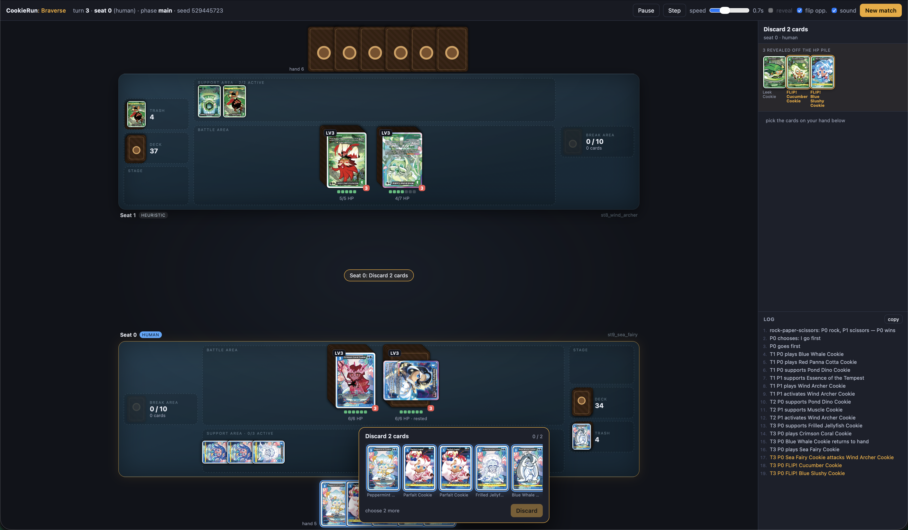
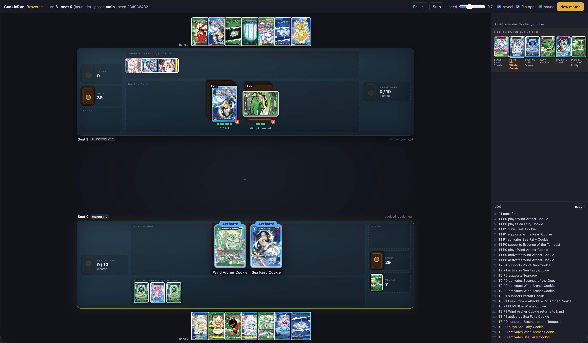

# Cookie Run: Braverse Simulator

Current Version: 0.2.5

[Cookie Run: Braverse Website](https://cookierunbraverse.com/en)

Example Images:
Human vs Bot


Bot vs Bot


A rules engine for CookieRun: Braverse plus a practice bot to play against. This is an **unofficial** project and much of the code was generated using Claude (I feel like this should be explicityly disclosed). However, this was initially to create an simulator for deck building and agent training.

If there are any issues (as I'm sure there will be), please create an issue or message me on discord: \_\_set\_\_. 

I am a Python programmer specializing in ML, so game development is not my forte and thus please excuse some more amateur attempts at design in this project. This is just for fun and with my downtime. I am also a very new CookieRun: Braverse player so I know the rules in this sim are not perfectly implemented.

## Roadmap

There are many things that are still needing to be updated and reworked, but I intend to get more feedback and critical features moving forward. Below are some of the things I'm considering in no particular order:

- Adding multiplayer. Of course TCG games are nothing without community and so this feature is one of my top priorities.

- Introducing customizability for sleeves and mats. Right now the placeholder images are a bit ugly and I'd like to make the game feel more fun.

- There is code to ensure we allow for as many cards as possible, however the newer sets have cards that are still missing and so this needs to be fixed.

- I would like to add a deck builder to this implementation. I think text base deck building can be easy to implement but is not as fun and requires more work.

- Better animations and sounds. This bit is lacking and I know this needs to be improved to make the gameplay more enjoyable.

- Further simplifying the installation and running of the game. I know that running python code is not most people's favorite way of launching a program so I would like to fix that asap.

### Contents

- [Cookie Run: Braverse Simulator](#cookie-run-braverse-simulator)
  - [Roadmap](#roadmap)
    - [Contents](#contents)
  - [Repository layout](#repository-layout)
  - [Install](#install)
    - [Card art](#card-art)
    - [A standalone executable](#a-standalone-executable)
  - [Quick start](#quick-start)
  - [What works](#what-works)
    - [A move you are offered is a move that does something](#a-move-you-are-offered-is-a-move-that-does-something)
  - [The visual player](#the-visual-player)
    - [Playing someone else](#playing-someone-else)
    - [The deck builder tab](#the-deck-builder-tab)
  - [The effect compiler](#the-effect-compiler)
    - [The log says how much damage landed, and what dealt it](#the-log-says-how-much-damage-landed-and-what-dealt-it)
    - ["HP cannot reach 0" does not stop the damage](#hp-cannot-reach-0-does-not-stop-the-damage)
    - [The mulligan](#the-mulligan)
    - [A sprung trap owns the middle of the table](#a-sprung-trap-owns-the-middle-of-the-table)
    - [Reveals are recorded as the card turns](#reveals-are-recorded-as-the-card-turns)
    - [Healing is cards, not a bigger Cookie](#healing-is-cards-not-a-bigger-cookie)
    - [A trap or a block, not both — and a block that costs a rest](#a-trap-or-a-block-not-both--and-a-block-that-costs-a-rest)
    - [Removal that skips the break area](#removal-that-skips-the-break-area)
    - ["This Cookie" on a FLIP is the card, not its host](#this-cookie-on-a-flip-is-the-card-not-its-host)
    - [Who goes first](#who-goes-first)
    - [Costs in angle brackets are a decision](#costs-in-angle-brackets-are-a-decision)
    - ["Up to N" is a choice of which, and of how many](#up-to-n-is-a-choice-of-which-and-of-how-many)
    - [A card filter cannot describe a card's state](#a-card-filter-cannot-describe-a-cards-state)
    - [The EXTRA deck](#the-extra-deck)
  - [Rules fidelity](#rules-fidelity)
  - [Self-play RL](#self-play-rl)
  - [Deck generation](#deck-generation)
    - [Not overfitting the shuffles](#not-overfitting-the-shuffles)
    - [Using the RL agent as the pilot](#using-the-rl-agent-as-the-pilot)
    - [Co-evolution](#co-evolution)
  - [Extending it](#extending-it)
  - [Source](#source)

## Repository layout

```
fetch_cards.py        downloads the card database from DotGG -> braverse_cards.csv
braverse/             the engine (library, UI-agnostic)
  cards.py            CSV -> typed CardDef, with the dump's typos normalised
  cost.py             {B}{B}{N} cost parsing and support-area payment
  state.py            zones, Cookies, GameState (plain data, deep-copyable)
  engine.py           phases, legal actions, combat, win conditions
  effects.py          the trigger registry and the vocabulary effects are written in
  effect_ir.py        effect IR + interpreter (ops, conditions, targets)
  compiler.py         rules text -> effect IR, for the bulk of the pool
  impl/               hand-written card effects, one module per set
  agents.py           RandomAgent, HeuristicAgent
  features.py         (state, action) encoding for learning agents
  rl.py               self-play RL: policy net, league, REINFORCE trainer
  deckgen.py          evolutionary deck generation
  decks.py            starter decklists + deck validation
  rps.py              the opening rock-paper-scissors for turn order
  config.py           every tunable rule, cited to the PLAY GUIDE
play_server.py        the visual player: play a bot, play a person, or watch two bots
viewer/               its browser front end (no build step, no dependencies, no assets)
                        app.js/style.css the table, builder.* the deck builder,
                        table.* the sleeve and playmat tab
selfplay.py           bulk self-play harness and win-rate report
train_rl.py           train / evaluate the RL agent
evolve_deck.py        evolve a decklist against a gauntlet
coverage_report.py    which cards the engine can play, and what to build next
coevolve.py           alternate deck evolution and agent training
compare_decks.py      round-robin decks under a chosen pilot
tests/                200 tests
requirements-play.txt just play the game (numpy only)
requirements.txt      the above plus RL, tests and tooling
```

## Install

**Python 3.9 or newer.** Check what you have:

```bash
python3 --version
```

If that errors, or prints something older than 3.9, install Python:

- **macOS** — `brew install python@3.12`, or the installer from
  [python.org/downloads](https://www.python.org/downloads/). The `python3` that
  ships with macOS works too if it is 3.9+.
- **Windows** — `winget install Python.Python.3.12`, or the installer from
  [python.org/downloads](https://www.python.org/downloads/); tick **Add
  python.exe to PATH**. Use `python` instead of `python3` in every command
  below.
- **Linux** — `sudo apt install python3 python3-venv python3-pip` (Debian /
  Ubuntu) or `sudo dnf install python3 python3-pip` (Fedora).

Then clone the repo and set up a virtual environment:

```bash
git clone https://github.com/<you>/cookie_run_simulator.git
cd cookie_run_simulator
python3 -m venv .venv
source .venv/bin/activate
```

On Windows the last line is `.venv\Scripts\activate` instead.

Then pick one of the two dependency sets.

**Just to play the game** — this is the one you want if you came here to sit
down and play a match. One small package, no PyTorch, a few seconds to install:

```bash
pip install -r requirements-play.txt
python play_server.py
```

That covers the whole game: the engine, the browser player against the
`heuristic` and `random` bots, `selfplay.py`, `evolve_deck.py`,
`compare_decks.py` and `coverage_report.py`. The only dependency is `numpy`,
which `braverse.features` imports. The browser front end has no build step and
no dependencies of its own — no npm, no bundler.

The one thing you give up is the RL pilots: the `rl_agent*.pt` checkpoints will
not be selectable as opponents in the visual player, and `train_rl.py` /
`coevolve.py` will not run. Everything else behaves identically.

**Everything, including the RL** — training, co-evolution, the test suite and
the Tabletop Simulator exporter. This pulls in PyTorch, so it is a few hundred
MB:

```bash
pip install -r requirements.txt
```

| Package  | In which file            | Needed by                                          |
| -------- | ------------------------ | -------------------------------------------------- |
| `numpy`  | `requirements-play.txt`  | required — `braverse.features`, imported by the package itself |
| `torch`  | `requirements.txt`       | `braverse.rl`, `train_rl.py`, `coevolve.py`, RL pilots in the visual player, `tests/test_learning.py` |
| `tqdm`   | `requirements.txt`       | progress bars in `train_rl.py` / `coevolve.py`     |
| `pytest` | `requirements.txt`       | running `tests/`                                    |
| `pillow` | `requirements.txt`       | `build_tts_sheets.py` (Tabletop Simulator sheets)  |

`requirements.txt` includes `requirements-play.txt`, so it is the superset —
never install both.

### Card art

The card database `braverse_cards.csv` is checked in, but the ~2000 card images
are not — they are 190 MB and belong to Devsisters, not this repo. Download
them once:

```bash
python3 fetch_images.py            # everything -> card_images/
python3 fetch_images.py --sets ST8 ST9   # just the two starter decks (fast)
```

It skips files it already has, so it is safe to interrupt and re-run. Without
them the visual player still works — cards just render as name plates instead
of art.

To refresh the card database itself: `python3 fetch_cards.py`.

### A standalone executable

`braverse.spec` builds the visual player into one self-contained binary — no
Python, no virtualenv, no `card_images/` checkout on the machine that runs it.
Hand someone the file, they double-click it, the browser opens:

```bash
python3 fetch_images.py             # the art goes inside the binary
pip install pyinstaller
pyinstaller braverse.spec           # -> dist/braverse  (198 MB)
```

It carries the engine, the browser front end, `braverse_cards.csv`, the
decklists and the **whole ~2000-card art library**, so any deck of any cards
renders. Drop a decklist `.txt` next to the binary and it shows up in the deck
menu — that is how a card outside the shipped decks gets played, and why the
art is bundled whole. A `.txt` beside the binary overrides a bundled one of the
same name. The spec refuses to build against a thin `card_images/`.

It leaves out the RL pilots, because torch would add about a gigabyte — the
pilot menu is human / heuristic / random. A `.pt` beside the binary is picked
up the same way decklists are, but still needs torch present to load.

The size is paid at every launch, not just once: a one-file bundle unpacks
itself into a temp directory each run, which is **about 6 seconds** before the
browser opens. If that grates, build a folder instead — flip `onefile=True` to
`False` in the spec, zip `dist/braverse/`, and it starts instantly.

PyInstaller does not cross-compile: build it on macOS and you get a macOS
arm64 binary, build it on Windows for a `.exe`. Unsigned binaries need one
right-click → **Open** on macOS the first time.

## Quick start

If you installed the full `requirements.txt`, run the tests to confirm it
(157 tests, about 30 seconds — they need `pytest`, and `test_learning.py` needs
`torch`):

```bash
python -m pytest -q tests/
```

Play 200 games of bot-vs-bot and print the win rates:

```bash
python selfplay.py -n 200
```

Drive the engine yourself:

```python
from braverse import Game, HeuristicAgent, SeatedAgent, STARTER_DECKS

agents = [SeatedAgent(HeuristicAgent(), 0), SeatedAgent(HeuristicAgent(), 1)]
game = Game([STARTER_DECKS["st9_sea_fairy"], STARTER_DECKS["st8_wind_archer"]],
            agents, seed=1)
game.setup()
while not game.state.over:
    options = game.legal_actions()
    seat = game.to_move()
    game.step(game.controller(seat).choose_action(game.state, options))
print(game.state.win_reason)
```

Or play a game yourself in the browser:

```bash
python play_server.py
```

Opens a board at `http://localhost:8080` — see [The visual player](#the-visual-player).

`legal_actions()` returns fully-specified moves (targets included) and
`game.clone()` gives an independent deep copy, so a search agent can be dropped
in without touching the engine.

## What works

- Full turn structure: active → draw → support → main → end.
- Support area as energy, coloured and generic (`{N}`) costs, resting to pay.
- Cookies played free from hand with a face-down HP pile drawn off the deck.
- Damage flips HP cards into the trash; FLIP cards fire on reveal.
- Fainting, the break area, [refresh], and both loss conditions.
- 【On Play】, 【Activate】, 【Once Per Turn】, 【Blocker】, attack riders, FLIP
  effects, faint triggers, Items, Traps (with a real defender response window),
  and Stages.
- The **EXTRA deck**, including 【Awaken】: a second pile of at most 6 cards,
  never drawn, each played through the gate printed on it.
- Both ST8 and ST9 starter decks are fully implemented and legal.

- **1393 of 1540 cards are fully playable**: 225 hand-written, 967 compiled
  from their printed text, 201 genuinely vanilla. `coverage_report.py` shows
  the split.
- **7 of 22 sets are 100% implemented** — ST6–ST10 plus BS8 and BS10. The 147
  cards still outstanding rest on mechanics the engine does not model —
  【Special Play】, 【Equip】, and replacement effects that rewrite an opponent's
  abilities — plus a tail of ITEM/TRAP/STAGE text that needs new compiler
  grammar.

### A move you are offered is a move that does something

The action list used to answer "can this be paid for?" and stop there, so a card
whose condition was false, whose target was not on the board, or whose
`<Discard 3 cards.>` you could not cover was still offered as a move. Taking it
spent the card and produced nothing. That is the engine asserting something
untrue about the position, which is worse than a missing convenience.

Every effect is now asked whether it would accomplish anything before its move
is listed. A compiled card answers for itself — its `If ...,` clauses are
`Guard` ops and its targets are `Select` ops, both of which the engine can read
without running them. A hand-written body is opaque Python, so it declares the
same thing with `@playable_if`, which is the `if` at the top of the function
hoisted to where the action list can see it. Anything that answers neither way
stays on offer: **wrongly hiding a card is the worse failure**, because a card
that is missing cannot be argued with, and a card with no implementation at all
is the engine's gap rather than something the rules say.

Two details decide whether this is right or merely close:

- The probe reads the board and never touches it. A rehearsal on a clone would
  answer more questions and cost a deep copy per candidate move per turn.
- An item is still in your hand while the list is built and gone from it by the
  time it resolves, so "if there are 5 cards or less in your hand" and
  `<Discard 3 cards.>` are both read against the hand *minus the card being
  played*. Off by one here hides live cards, which is the failure that matters.

Across 200 starter-deck self-play games this suppresses **5476 moves** and the
results are bit-identical — 179/200, the same mean turn count, the same
outcomes. The scripted bot was never taking those moves, because a move that
does nothing scores nothing. They were only ever shown to a person.

The cost is about 15% of raw simulation throughput (188 → 179 games/s on the
starters), paid on every `legal_actions()` call.

Cards whose text the compiler does not fully understand stay vanilla and are
kept out of the generated deck pools. `coverage_report.py` shows exactly where
that line falls.

## The visual player

```bash
python play_server.py            # --port 8080 --no-browser
python play_server.py --lan      # also reachable from the rest of the network
```

Stop it with ctrl-c. It also shuts down on SIGHUP and SIGTERM, so closing the
terminal takes the server with it rather than leaving something holding port
8080; if the port is busy anyway it names the PID still on it.

A playmat with the printed card art. Cards in the battle area are drawn larger
than the ones in a support row, because that is where the game is actually read;
every stand-in overlay — the flip reveal, the break, the skill popup — sizes
itself off the same two CSS variables, so they cannot drift apart. On a short
window the board scrolls: it used to be a grid whose rows got fitted to the
container, which squeezed the mats until they overlapped each other.

The board shows the two battle areas with their face-down
HP piles, the support area, the stage, deck and trash, the break-area clock, and
both hands. Pick a pilot and a deck for each seat — `human`, `heuristic`,
`random`, or any `rl_agent*.pt` checkpoint in the directory — plus any decklist
`evolve_deck.py` has written. Two bots means spectating, with pause,
single-step, and a speed slider; a `human` seat means you play that side.

**Click a card and it tells you what it can do.** The menu lists that card's
legal moves by the name the card prints for them — "Bike Blast", "Tracker's
Arrow" — because 980 of the Cookies name their attack. The 220 that use the
older `<{P}{P}> Deals 2 damage.` printing have no name to show, and no
【Activate】 skill in the whole pool is named, so those fall back to the marker
itself: "Attack" and "Activate". The move list on the right tags the same
names.

**The round, above the break area.** A strip on each mat shows Active → Draw →
Support → Main → End, lit for whoever's turn it is and dimmed on the other side.

It deliberately reads more than `state.phase`, because that field alone would be
a lie by omission: the engine only ever *reports* `main` to a player — it untaps
and draws inside the turn machinery, and never enters `support` at all, since
placing a support card is a main-phase action capped at one per turn rather than
a phase you stop in. So Active and Draw show as already resolved (and Draw reads
*skipped* for whoever opened, who forgoes their first draw), End as still to
come, and Support carries the one thing you can still act on: it pulses **ready**
until this turn's support card is placed, then settles to **done**. That is the
nudge — forgetting the free support card is the easiest mistake in the game.

**Questions about cards are answered by pointing at cards.** When an effect
asks which Cookie to damage or debuff, the candidates are outlined on the board
and you click the one you mean — no trip to the list on the right. The same goes
for a card in your support area. Cards you *cannot* reach on the table — in your
hand, trash, break area or deck — come up as a strip instead, which is decided
structurally rather than by prompt text.

**Questions about your hand are answered with your hand.** Discarding, opening
with a Cookie, fielding a replacement when one faints — all the same gesture:
your hand comes up as a strip, you toggle up to the number asked for, and the
confirm button says what you are about to do (*Discard*, *Play Cookie*).
Choosing from a list on the far side of the screen while your hand sits at the
bottom was the wrong way round. With one card to pick, clicking a second moves
the choice rather than refusing it.

Which questions get the strip is decided structurally — every option is a card
that is in your hand — rather than by matching prompt text, so a new prompt of
the same shape gets it for free; only the verb reads from the prompt.

That needed one engine change. `Game.discard` asked its controller once *per
card*, which is the natural shape for a greedy bot and the wrong shape for a
person. `effects.ask_many` now asks a controller that implements `choose_many`
for the whole selection in one question and loops `choose` for everyone else —
so every scripted agent behaves exactly as before, bit for bit, and only the
human seat sees the difference. It also normalises a short, padded or repeated
answer, because "discard 2" has to remove exactly two cards however the client
phrases it.

**Sleeves and playmats, per seat.** The **Table** tab picks a card back and a
felt for each side, the way a kit belongs to a player rather than to a chair.
Everything is drawn in CSS — gradients, not image files — for the same reason
the rest of the front end has no assets: the viewer stays a folder of text, and
the one-file build does not grow by a megabyte per sleeve.

The choice is written to `<body>` as `-me-` / `-opp-` custom properties, which
`style.css` maps onto `.side.me` and `.side.opponent`. That one indirection is
what lets the kit survive a re-render, a seat swap and a refresh without any of
the board code knowing the tab exists — and it has to be variables rather than
classes, because `seatPerspective` decides which section is which by
overwriting `className`. Every sample in the tab is the real thing at a smaller
size: a swatch is an actual `.card.back`, a mat sample is the actual mat
background, so a preview cannot drift from the table it previews.

A mat carries its dashed zone outlines and label colour with it, since a pale
felt wearing the dark felt's outlines is unreadable. The two seats start on
different sleeves, because telling your cards from your opponent's at a glance
is what sleeving them is for.

**Traps stand up when they can be sprung.** A response window is the one moment
your hand can act on someone else's turn, and the only card in it that can act
is a trap you can pay for. Those rise out of the hand with a green ring; the
rest stay flush. Finding out which of six cards was live meant clicking through
all six, during the one decision in the game that is genuinely time-shaped.

**Drag and drop.** Pick up one of your cards and the legal drops light up:
a Cookie card onto your battle area to play it, any card onto your support area
to place it, one of your Cookies onto an enemy Cookie to attack it. Dropping
somewhere illegal does nothing, and a drag that goes nowhere falls back to
being a click.

Dragging is only ever a second way to name an option the server already sent:
a drop resolves to (subject, target) and then looks for the one legal action
that matches, so the drag layer cannot invent a move the engine did not offer.
When an effect asks a question mid-resolution — "Damage which Cookie?" — the
cards it is choosing between are outlined and clicking one answers it.

**End turn** sits in the middle of the table, next to the turn banner, as well
as at the end of the move list — it is the move you reach for most and the far
corner of the screen is the worst place for it.

Hover any card for its full text; click one to filter the move list down to the
moves that use it; click the trash or break area to search through it, where the hover preview
now paints over the browser rather than behind it — a modal `<dialog>` lives in
the browser's top layer, which no z-index can beat, so the preview moves inside
it while it is open; keys
`1`–`9` take the numbered option and `space` / `→` pause and step. `reveal`
shows both hands, and is a spectator's tool only: in a match you are playing it
is disabled and ignored, so your opponent's hand stays hidden however the
request is made.

`flip opp.` (on by default, remembered per browser) turns the opponent's half
through a full 180°, the way their mat would sit across the table from you:
rows swap so their support area is above their battle area, columns swap, each
column's contents reverse — so their stage, deck and trash mirror yours across
the centre line — and their cards face them, so you see the art upside down. A
rested card of theirs sits at 270° rather than 90°, for the same reason. Zone
labels, counters and the reveal animation stay upright, because those are the
interface rather than the board; hover any card to read it the right way up.
Turn the option off to see both halves in the same orientation.

**Cards turn, they do not snap.** Resting to attack or to pay a cost, and the
sweep back to active at the start of your turn, are animated in both directions
— staggered slightly when a whole support row untaps at once. The board is
rebuilt from scratch on every commit, so a CSS transition has nothing to move
*from*; the renderer remembers how each card sat last time it was drawn, starts
the new node at that angle and lets it turn to the one the stylesheet asks for.
The reset to the stylesheet's own transform is on a timer rather than the
animation's end, because a backgrounded tab never fires the frame that would
start it, and a card must never be left lying at the wrong angle.

**Cards are dealt, not conjured.** A draw sends a face-down card arcing from
that player's deck to their hand before the hand redraws underneath it. The
event carries a *count* and nothing else — a drawn card is secret, so there is
no identity to send and nothing to leak — and it is told apart from a card
arriving in hand some other way (a Cookie bounced off the board) by pairing the
arrivals against how far the deck actually fell.

**Actions play out.** One action can be a whole little scene, and the browser
plays it as a sequence: the attacker steps out of its slot, turns side-on
alongside the Cookie it is hitting and settles back; the defender takes the hit
and shakes; damage turns HP cards face up; a Cookie that breaks snaps in two
along a jagged seam and the halves fall apart. Both halves carry the whole card
art, each clipped to one side of the *same* randomly generated polygon, so the
crack matches tooth for tooth and no two breaks look alike. `sound` (on by default) adds card flicks, the swing and its impact,
and a crunch when a Cookie breaks — all synthesised with WebAudio at play time,
so there are no audio files to ship and nothing to download. Browsers will not
start audio without a user gesture, so the first click or key press unlocks it.

The attack comes from the *action*, not a state diff — an attack is a thing a
player did, and by the time it resolves the target may be off the board
entirely — while faints come from a diff of the battle area, which catches
"placed in the trash" and effect bounces as well as ordinary fainting, and marks
which of them actually banked Level in the break area.

**The board is deliberately a beat behind the server.** Events describe what an
action *did*, so they have to be animated against the board as it was before
it: the attacker must lunge at a Cookie that is still standing, and an HP card
must turn face up over the pile it came off. Rendering the new state first left
the attacker swinging at an empty slot every time it killed something. So the
browser plays the scene, *then* commits the state, holding the newest snapshot
until it finishes and refusing clicks in the meantime — an option index from the
old list would answer the question the server has since moved on to. The bot
seats wait out the same scene, so nothing happens off screen: the pause is
computed from the events themselves (`scene_seconds`) rather than being a fixed
beat, and is capped so a pathological batch cannot stall the match. It counts
each animation through to its *end* rather than its start — a bot must not move
again while a revealed card is still being read — so an attack that turns three
HP cards face up and breaks a Cookie holds the board for about six seconds.

**Damage is animated.** An HP card turning face up is the swing moment of a
battle — a FLIP fires the instant it is revealed — so each revealed card turns face up over the Cookie it came off
rather than a number quietly ticking down. It is held enlarged for about a
second and a half, which is the difference between seeing that something
happened and reading *what*, and the bot seats wait an extra beat after a reveal
so the board does not move on underneath it. The panel also keeps the last
reveal as a strip of thumbnails, so one you blinked through is still there —
worth having, because the log only records FLIPs, not ordinary HP cards.

That needs no engine callback: an HP card moves straight from the face-down pile
to the trash, so diffing those two zones between snapshots *is* the reveal, and
a card an effect bounces out of the pile correctly does not count. Two things
that bit, both now pinned by tests or comments: several `publish` calls can
share one game state, and diffing them against each other erased the reveal
before the browser polled it; and the obvious way to write the flip —
`backface-visibility` on a `rotateY` — is not honoured everywhere, so the card
stayed back-side up through the whole animation. It is a 2D squash-and-swap
instead.

### Playing someone else

Start the server with `--lan` and hit **New match → Play someone**. Hosting
gives you a four-character room code and a link to send; the other person opens
the link on their own machine, picks a deck and joins, and the game deals
itself. One machine runs the server and the engine; both browsers are only ever
renderers, exactly as they already were against a bot.

Everything that makes this safe was already true of the single-player design,
which is why the whole feature is a few hundred lines rather than a rewrite:

- **The server holds the one true state.** It always did — the match runs on its
  own thread and the browser polls a snapshot — so "the opponent's browser"
  never has a state of its own to disagree with, and there is no reconciliation
  to get wrong.
- **A move is an index into a list the server just built.** The browser cannot
  name a card, a target or an amount; it can only pick from the legal moves it
  was offered. So a hacked client cannot play a card it does not have, attack
  out of turn, or invent a cost payment — the worst it can do is choose badly.
- **Hidden information is filtered on the way out, per viewer.** `Match.view`
  takes the seat asking and hands back that seat's hand and nobody else's. The
  question the engine is putting to your opponent is stripped too, down to its
  prompt text: its options are routinely *their hand*, so sending them would
  leak the game through the one channel the board does not.
- **A seat is a token, not a claim.** Joining mints a token; the room code, which
  travels in the link, buys nothing but a spectator's view. Every move is
  checked against the seat the engine is actually asking, so your opponent
  cannot answer for you — with the same code, in the same room, holding the
  same page.

The browser is told to wait rather than to ask again: a poll carries the version
it already has and the server holds the connection until something happens, so
a move lands on the other screen as fast as the network carries it, and an idle
game costs one open connection instead of three requests a second. That is also
why a rematch keeps counting versions from where the last game stopped — a
browser parked on "tell me when this changes" has to be told that the game it is
waiting on is not the game any more.

Two conveniences that fall out of it: closing the tab and reopening the link
puts you back in your seat mid-game rather than making you a spectator of your
own match, and the pacing controls — pause, step, speed, reveal — are refused
outright in a room. Pausing would freeze a person rather than a bot, and reveal
would simply be cheating.

What this is not, yet: there is no matchmaking, no accounts, no ranking, and no
clock on a decision, so a player who wanders off leaves the game sitting there
until someone hits **Leave**. Decks come from the host machine's collection,
not from the joiner's, which is the next thing to fix if this ever leaves the
LAN.

### The deck builder tab

The second tab in the header is a deck builder, so a deck can be put together
in the same window it will be played in.

The left half is the card pool — every card the engine will accept in a deck,
which is the whole library minus banned cards and NPCs — searchable by name, id
or rules text and filterable by type, colour and set. The **playable** filter,
on by default, narrows it to the cards whose printed effect the engine actually
implements; turn it off and the rest of the pool is there too, playing as
vanilla bodies. Searching happens server-side over a lowercased index built once
(`pool_index`), because re-scanning 1500 cards' rules text on every keystroke is
the sort of thing that makes a search box feel broken; results come back a page
at a time.

Click a card to add it, click a card in the list to take one out. The pane on
the right keeps the running count against the 60-card deck, the copy count for
each card number, the cookie and FLIP totals, and a line saying whether the deck
is legal — **and that line is the server's answer, not the page's**. It comes
from `POST /api/deck/validate`, which runs the same `braverse.validate` a match
runs at setup, so the builder cannot bless a deck the game would then refuse.
The page enforces the two limits that would otherwise be annoying to hit by
accident — 60 cards, and four copies of a card *number* (alt arts of one number
share the cap, which is why every card carries its `baseId`) — but it is not the
authority on either.

Decks are saved into `saved_decks.json` beside the script, or beside the binary
for a frozen build, dropping back to `~/.braverse/` if that directory is
read-only. It is a plain `{name: [card ids]}` file, so a deck can be edited or
copied by hand, and it is written through a temporary file so an interrupted
save cannot leave half a decklist behind. Saved decks join the starter lists and
anything `evolve_deck.py` wrote in `available_decks()`, so a deck is in the New
match dropdown the moment it is saved — no restart. A saved deck wins a name
clash with a starter list, on the grounds that you made that one on purpose.

An illegal deck still saves. Half-built is the normal state of a deck you mean
to come back to; it simply cannot be picked for a match until it is 60 cards.
Loading a starter or generated list opens it as `<name> copy`, so editing one to
see how it feels cannot silently shadow the deck it came from.

**Why it is a server and not a script.** The engine calls its controllers
*re-entrantly*: the defender's trap window opens inside `game.step`, and so does
every mid-effect decision ("discard a card", "damage which Cookie?"). A human
seat therefore cannot be a function that returns a move and unwinds. The match
runs on its own thread and a human seat blocks there until the browser answers
the question the engine is currently asking, so the UI drives the *same*
`Controller` protocol the bots implement — no special human path in the engine,
and traps and effect targeting work for a human for free.

Bot seats pass through the same gate, which is what pause and step are: the gate
simply does not open. Only turn-level decisions are paced, so an attack and
everything it triggers reads as one beat rather than a stutter.

Hidden information is filtered **server-side**, on the way out: your opponent's
hand never reaches the page, so there is nothing in the browser to leak — and
because the filter is applied per request rather than baked into the snapshot,
asking for a reveal over the API cannot get around it either. Every
HP pile is stripped for *everyone*, including its owner and including under
`reveal` — the pile is face down in the real game and the not-knowing is the
point. Public zones (trash, break area) are sent in full, which is what makes
them searchable. The `reveal` toggle needs no replay, because the filter runs
over a snapshot rather than being baked into it.

## The effect compiler

> Writing a card yourself? **[docs/writing-cards.md](docs/writing-cards.md)** is
> the practical guide — where the card goes, which trigger to pick, the `Ctx`
> vocabulary, and how to test it.

Hand-writing 1200 cards was never going to happen, and the text is templated
enough not to need it. `braverse/compiler.py` parses rules text into the ops in
`braverse/effect_ir.py`, which the interpreter runs against the same `Ctx` a
hand-written card would have called.

It is compositional rather than template-matched — a clause is an optional run
of `<...>` costs, an optional `If ...,` guard, and a verb phrase from a small
vocabulary — because the same atoms recombine endlessly across the pool.
`That Cookie receives N damage.` alone appears on 177 cards.

Two rules keep it honest:

- **All or nothing.** A card is registered only if *every* clause in its text
  compiles. A card that half-resolves is worse than a vanilla one, because it
  silently misreports what the game does. 45 cards currently compile partially
  and are deliberately held back.
- **Hand-written always wins.** The compiler skips any card already in the
  registry, so it can only ever add coverage. ST8/ST9 self-play results are
  bit-identical before and after compilation, which is the regression check.

Finding the grammar also surfaced two real bugs in the card parser: the older
`<{P}> Deals 3 damage.` printing left a bare `" damage."` as rider text on 223
cards, and the clause splitter was breaking `LV.2` at the period.

A third was worth more than both. The dump files an ITEM/TRAP/STAGE's rules
text under `attackText`, not `description` — the whole card for 160 of them,
and for 18 stages just the 【Activate】 half, leaving a description holding only
the placement line. The parser read non-Cookie text and its lead cost from
`description` alone, so all 160 parsed as **free, textless vanillas**: they cost
nothing to play, did nothing when played, and went straight to the trash.
Wanderer's Apple Pie (BS1-075) is the whole card in one line — `<{G}{G}> Place
this card in your support area as rested.` — and it was doing none of it.

Joining the two fields is what makes them visible, and **94 of them compile
immediately** against grammar that already existed. Eleven stage cards go the
other way: they had been counted as implemented because a placement-only
description reads as a legitimately vanilla stage, and the 【Activate】 they were
hiding does not compile yet.

That is why headline coverage *fell* from 93.7% to 89.0% here. The number went
down because the denominator got honest — those 160 cards had been sitting in
the "playable as printed" column, counted as complete because their text could
not be seen, and every set that read as 100% before was resting partly on that.

Two smaller things fell out of it. The compiler was paying an item's lead cost a
second time on top of the `play_cost` the engine already charges, so a `{Y}{Y}`
item rested four support cards instead of two. And once the stages were joined
back together, **no card in the pool is placement-only any more** — the "vanilla
stage" case now describes a card the pool does not actually contain.

A fourth defect is not a parsing bug but a wrong fact. The dump prints
【Activate】 on 106 cards whose printed badge is 【On Play】 — every one of them
from BS1–BS4, ST1–ST5 or P, and nothing from BS5 onward, which is the shape of
an upstream error in the early sets rather than anything this repo does. The two
markers are colour-coded on the card face (teal for On Play, magenta for
Activate), so the correction was read off the scans in `card_images/` badge by
badge and pinned as `cards._ON_PLAY_MISPRINTS`, applied when the row is loaded.

It matters more than a label. An 【Activate】 is a main-phase skill its controller
presses, once a turn, for as long as the Cookie lives; an 【On Play】 fires once,
as the Cookie is played, and never again. Read the dump's way, a third of BS3's
Cookies were repeatable engines — Wind Archer Cookie (BS2-058) trashed one of
your opponent's LV.3 Cookies *every turn* for `{P}`. Nineteen hand-written
effects moved trigger with the data; the other 82 recompile under `ON_PLAY` on
their own, so pool coverage is unchanged and ST8/ST9 self-play — neither set is
affected — stays bit-identical.

Coverage is **89.0%** of effect-bearing cards, reached by alternating two passes:
structural compiler work, then hand-writing whatever a set had left. Working
set by set was what surfaced the engine's real gaps — each set needed fewer new
mechanics than the last (BS1 needed six, BS10 two), and the compiler carried a
growing share of each one.

The earlier growth came from targeting *structural* shapes rather than
individual phrases, once the per-phrase tail went flat (top blocker: 5 cards):

| fix | cards unlocked |
|---|---|
| strip the `When this Cookie faints,` trigger prefix | 59 |
| parse `During this turn, if X, ...` as a guard | 43 |
| one generic `MoveCards` op for trash/break/deck movement | 64 |

The last one replaced a family of clauses — "return X from your trash to your
hand", "select X from your break area and place it in the trash", "place X on
the bottom of the deck" — with a single op plus a card-level filter. Two of
these needed new engine state: per-turn faint and break-area counters, reset for
*both* players each turn, since "during this turn" clauses routinely ask about
the opponent's losses.

### The log says how much damage landed, and what dealt it

Every attack names its number — `Sea Fairy Cookie attacks Leek Cookie for 3` —
and every damage step reports what was actually taken off the pile, and whether
it was the swing or something else:

```
T7 P0 Sea Fairy Cookie attacks Leek Cookie for 3
T7 P0 Leek Cookie takes 3 attack damage — 2 HP left
T7 P0 Leek Cookie takes 1 effect damage — 1 HP left
```

A swing is `attack damage`; a `Then, ...` rider, a skill and a trap are all
`effect damage`, since they all route through the same `Ctx.deal_damage`.

`effect damage` says it was not the swing; it does not say *which* card did it,
and with a dozen cards on the board and a FLIP turning over mid-attack that is
most of the question. So every line written while an effect is resolving is
stamped with the card resolving it — `Game._effect_source` pushes the name
around each effect body and `GameState.record` reads the top of that stack:

```
T7 P0 Leek Cookie takes 3 attack damage — 2 HP left
T7 P0 FLIP! Blue Slushy Cookie
T7 P0 [Blue Slushy Cookie] Leek Cookie gains +1 HP — 3 HP
T7 P0 [Wind Archer Cookie] draws 1 card
```

The stack is nested, so a FLIP that fires inside an attack names the FLIP rather
than the attack that turned it over, and lines the engine writes on its own
account — playing a Cookie, resting for a cost — carry no name at all.

The board says it too, without a word being read. A swing shoves the card,
flashes it white and throws a heavy red number out sideways, over the thud of
the impact; a rider, skill or trap pulses the card cool blue, floats a smaller
number straight up and ticks rather than thuds. Both numbers are set large and
carry a hard dark outline, so they stay legible over card art of any colour —
`paint-order` puts the stroke behind the glyph where it is honoured, and a ring
of text shadows does the same job where it is not. Being chipped twice by riders
now looks nothing like being hit once, hard.

That distinction cannot be recovered from a state diff — a swing and the rider
that follows it take HP off the same Cookie in the same step — so the engine
keeps a structured `state.events` alongside the prose log and the server drains
it. Delivery is one-for-one and in order, which is worth a test: an animation
that silently doubles or drops a hit would be worse than none.

The `(of N)` is the interesting part: damage reveals HP cards one at a time, so
the count that lands is not always the count that was asked for. Auditing 2446
damage steps across 120 games turned up the reasons it can differ, all correct
and all visible in the log — the pile ran dry, an effect took the target off
the board mid-step, or the game ended. Another case removes *more* cards than
the Cookie started with: a FLIP that heals its host (`<Discard 1 card.> ...
gains +1 HP`) hands HP back while the loop is still running, so a 3-damage
attack on a 2 HP Cookie legitimately turns three cards. No case applied the
wrong number.

### "HP cannot reach 0" does not stop the damage

`hp_cannot_reach_zero` — Divine Light Crystal (ST3-020), Squid Ink Cookie
(BS5-081) — used to be read as a floor: the loop stopped one card short of
emptying the pile, and the rest of the hit vanished. That is the wrong half of
the sentence. What cannot happen is the Cookie reaching 0; the damage still
happens. So `deal_damage` now turns every card the hit paid for and pulls a
replacement off the deck each time the pile would empty. The Cookie is still
standing at the end of it, every FLIP in the pile still fired, and `(of N)` no
longer has a reason to be short. The cards it replaces come off the deck, which
is a real cost — a big hit into the floor mills the protected player.

The floor holds on every path that can empty a pile, not just damage: "place N
cards from the top of that Cookie's HP into the trash" takes HP to 0 just as
surely, so `Game.hold_the_floor` is called from `Ctx.trash_hp` too. The card
says HP cannot reach 0, not "cannot reach 0 from damage".

Divine Light Crystal itself was on `KNOWN_UNCODED` and did nothing at all: the
trap was played, the `{G}{G}` was paid, and the Cookie fainted anyway. It is
hand-written in `impl/st_misc.py` now.

**And then it still did nothing**, for a different reason worth writing down.
The `<{G}{G}>` printed at the front of an ITEM or a TRAP *is* that card's play
cost — `CardDef.play_cost` — and the engine rests support for it before the
effect body is ever called. The body paid it a second time. So the trap worked
only for a player holding four green support, and when it did not work it
failed the way a `<...>` cost always fails: silently, doing nothing. Two cards
had that bug (ST3-020 and BS9-043) and `tests/test_engine.py` now has a
structural check that no hand-written ITEM or TRAP body pays a cost equal to
its own `play_cost` when the printed text has only one bracket.

The test that was supposed to cover this card is the other half of the lesson.
It called the effect function directly with support already on the board, which
skipped the engine's payment entirely — and then *asserted the double charge*
("the {G}{G} was not paid"). It passed for exactly as long as the card was
broken. It goes through `_response_window` now, with exactly the two green
support the printed cost needs and not a card more, which is the only version
that fails when the card does.

### The mulligan

`RulesConfig.allow_mulligan` had been sitting there as a constant nothing read.
The opening sequence now runs draw 6 → **mulligan** → the mandatory
"no Cookie in hand" redraw → place the opening Cookie, in that order, so a
mulligan into a Cookie-less hand still triggers the forced redraw the guide
describes. The whole hand goes back, the deck is shuffled, six new cards come
off it; there is no card penalty and it is offered exactly once.

Only a controller that implements `wants_mulligan` is asked, which in practice
means a human seat. A scripted agent has no read on hand quality, so answering
for it would replace every opening hand in every self-play game with a random
one — every number in this README would move, and the bots would not play any
better for it. Same carve-out, and the same reasoning, as
["up to N"](#up-to-n-is-a-choice-of-which-and-of-how-many).

### A sprung trap owns the middle of the table

A trap is the only card that fires on someone else's turn, in the middle of
their attack, and half the time it is the thing that decides the attack. It was
animated as a `skill` — the small pop that appears over the card that used it,
on its owner's half of the board, which is where you are *least* likely to be
looking while your own attack resolves.

It has its own event type now. The board dims, the card slams down in the
middle at twice its normal size with a `TRAP` banner and its name, and only
then does the damage or the debuff it caused play out underneath — the trap
takes a full second of the timeline before anything it did starts. Your own
trap comes up gold and your opponent's red, so which way it cuts is readable
before the name is. The veil is sized onto the visible part of the board rather
than the window, so the log stays lit and a scrolled table still gets the card
on screen.

### Reveals are recorded as the card turns

The flip animation used to be driven by a zone diff: an HP card that reached
the trash between two snapshots had been revealed. That is true, but it can
only ever be noticed *after* the FLIP has resolved — so the board played the
heal, the draw or the bounce and only then showed the card that caused it.

The engine records the reveal itself now, at the moment the card turns and
before the FLIP runs, next to `damage` and `heal` in `state.events`. One batch
of events reads:

```
attack > reveal > reveal > reveal > heal > damage
```

and the browser plays that list **in order** rather than sorting it into piles
by type first. `playEvents` walks the batch once and lays each event on a clock.
Two things do not simply take the next slot: attack damage lands part-way
through the swing that caused it rather than after it, and a faint waits for any
revealed card to clear, because the board must not change under a card someone
is still reading. `scene_seconds` on the server mirrors the same walk, since it
is what decides how long a bot waits before moving again.

`Ctx.trash_hp` reveals too — "place N cards from the top of that Cookie's HP
into the trash" turns cards face up — but flagged `flip=False`, because no FLIP
fires on that path and it should not read as one.

### Healing is cards, not a bigger Cookie

"That Cookie gains +1 HP" hands a card back onto the HP pile. It used to also
raise `Cookie.hp_bonus`, which fed `max_hp` — so a Cookie healed twice read as
`8/8` and looked like a card it is not. HP *is* the pile; the printed value is
printed. `max_hp` is now the printed HP alone, `gain_hp` only refills, and a
pile above the printed value is shown as an overheal: green ticks on the end of
the HP bar (`8/6 HP (+2)`) rather than a longer bar.

Healing was also invisible while it happened, since a heal inside an attack is
gone from a before/after diff of the pile by the time the browser polls. It is a
`heal` event now, next to `damage` in `state.events`, and the board plays it as
a green glow around the card with a green number rising off it — the same beat
as the hit that provoked it, and deliberately the opposite shape to the red
shove of a swing.

### A trap or a block, not both — and a block that costs a rest

Two things were wrong with the defender's response window.

**The price of a block was only half read.** `_blocker_cost` pulled the energy
out of `【Blocker】 <...>` and treated anything else as free. Five cards —
Blue Lily Cookie BS4-047, Peperoncino, Moon Rabbit, Captain Ice, Space Doughnut
— print that price as `<Rest this card.>`, so they redirected every attack in a
turn for nothing and were still upright afterwards to swing on their own. The
cost is now returned as `(energy, rests itself)` and both halves are paid. A
price the engine cannot read at all returns `None`, which means the Cookie
cannot block: an unreadable cost is not a free one.

**A trap and a block were being allowed on the same swing.** Springing the trap
is the defender's answer to the attack, and so is putting a Cookie in the way;
the window let them do one and then the other. `_responded` records which was
taken and closes off the other for the rest of that attack — in both
directions, so no block after a trap either.

While in there: an attack announces itself at its printed number
(`Lobster Cookie attacks Sea Fairy Cookie for 3`) *before* the response window,
because that is when it is declared. If a trap or a defensive skill shaves it
in between, the log now says so — `attack is reduced to 1 (from 3)` — rather
than leaving a 3-damage attack that inexplicably took one card off the pile.

### Removal that skips the break area

Implementing the ST sets surfaced a rules distinction the engine did not have:
**"place that Cookie into the trash" is not fainting.** A trashed Cookie never
reaches the break area, so its owner's opponent banks no Level for it. That is
why those effects are priced the way they are, and it is now a separate
`trash_cookie` path with tests contrasting it against a normal faint.

Three other mechanics came with it: a `TRASHED` trigger (distinct from `FAINT`),
`skip_next_active` for "not set as active during your opponent's next Active
Phase", and an `ATTACK_START` hook so static 【Your Turn】 buffs read the board
as the attack is declared rather than being stored.

### "This Cookie" on a FLIP is the card, not its host

`Return this Cookie to your hand` (Muscle Cookie ST8-002, Blue Whale Cookie
ST9-003 and three others) sits in an HP pile and fires when damage reveals it.
The engine used to read "this Cookie" as the Cookie the card was serving as HP
for, so the host bounced off the board — cancelling the rest of the damage and
denying the attacker the Level it would have banked.

That was wrong, and the card pool says so plainly. **Every one of the 92 FLIPs
that means its host spells it out**: "the Cookie with this card attached for HP
gains +1 HP". Only five say "this Cookie", and if that also meant the host the
long phrase would never have been needed. So it is the revealed card that
returns to hand — out of the trash it was just put in — while the Cookie it was
serving keeps taking the rest of the damage.

The fix lands in both places a card can be implemented: `Ctx.return_self_to_hand`
for the hand-written two, and `REF_SELF` inside a FLIP for the three the
compiler handles. `REF_HOST` still means the host, which is what the long
phrasing compiles to.

Two things fell out of it. No FLIP can move its host off the board any more, so
the `flip_bounce_beats_faint` rules flag — added to arbitrate whether such a
bounce beat a faint at 0 HP — was guarding a case that can no longer happen, and
is gone. And a pinned self-play number moved (19/30 to 20/30 for one fitness
call); that is a rules change rather than drift, so it was re-pinned
deliberately.

### Who goes first

`braverse/rps.py` plays the guide's opener: both controllers throw, ties are
re-thrown, and the winner picks who starts. Each round is logged *as it
happens* rather than in one block at the end — a tie sends you straight back for
another throw, and being re-asked with no explanation is baffling. The browser
puts the whole toss in the middle of the table, big enough to hit, instead of in
the panel on the far right. `Game(first_player=...)` takes the
answer — the engine no longer assumes seat 0 opens, so the skipped first draw,
the no-attacks-on-turn-one rule and the round counter all follow whoever
actually won.

It is deliberately *not* inside `Game.setup`. Bulk self-play and RL training run
millions of games where the ritual would only burn RNG and wall time, and every
harness here wants seat 0 to start so its numbers stay comparable; the visual
player calls it, the training loops do not. `HeuristicAgent` throws at random —
a fixed throw is free to read — and always takes the first turn.

### Costs in angle brackets are a decision

`<...>` on a card is a cost you *may* pay: pay it and the effect happens,
decline and nothing does. The engine used to pay it automatically the moment it
could afford to, which is wrong in the case that matters most — a FLIP turning
over mid-attack would quietly rest its controller's support or bin a card from
their hand, on the opponent's turn, without asking.

`Ctx.wants_to_pay` now gates every bracketed cost, on both card paths: the
compiled clause (386 cards carry a `<...>`) and the hand-written bodies, whose
`ctx.discard(n, optional=True)` *is* the printed `<Discard N cards.>`. The rule
is who asked for the effect. Triggers the controller opted into by choosing an
action — 【Activate】, an Item, a Trap — pay without a prompt, because taking
the action was the decision. Everything that merely happens to them asks first.
A cost that cannot be met is never offered, and a clause whose cost *is* an op
(a discard) asks once rather than once per op.

`HeuristicAgent` answers yes to every cost, so bot play and the self-play
numbers above are unchanged; it is a human seat that gains the choice.

One bracket was being read as free rather than as a cost. `<can be used as
{R}.>` sits on 72 cards, almost all of them attack riders, and the compiler
skipped it on the grounds that the colour substitution it describes is not
modelled — which handed every one of those riders an effect that fired after
every swing for nothing. Pitaya Dragon Cookie (ST6-004) was pinging an extra
point of damage on every attack it made, all game. It compiles to `PayCost` of
one energy of the colour named now: not free, and if anything a shade stricter
than the printed card, which is the safe direction to be wrong about a cost.
The starter-deck self-play numbers did not move, because a mono-colour deck can
almost always pay a single symbol of its own colour.

### "Up to N" is a choice of which, and of how many

"Rest up to 2 cards in your support area" was resolved by resting the first two
active cards. Both halves of that are decisions the player should be making:
*which* cards go down decides what colours are left to pay with, and *how many*
go down is what a card like "receives damage equal to the number of cards rested
by this effect" reads afterwards. `Ctx.rest_support` now puts the active support
cards up as a pick-and-confirm — none, one or two — through the same batch
question a multi-card discard uses (`ask_many`, extended with an `up_to` mode
that does not pad a short answer). The viewer's confirm button is live from zero
picks and the counter reads `0 / up to 2`, so declining is visibly an answer
rather than a stuck prompt.

Scripted agents are deliberately left out of it: they have no opinion worth
asking for, and giving them one would move the self-play numbers for no gain. A
controller that implements `choose_many` — which in practice means a human — is
asked; everyone else still rests the first N.

### A card filter cannot describe a card's state

`parse_card_filter` reads a phrase like "3 {R} Cookies" into a filter over
*printed* cards. Handed "2 **active** cards or more in your support area" it
quietly dropped the word it could not express and matched every support card —
so Hero Cookie (BS5-063) drew two cards at the end of every turn regardless of
how much of its support was rested, and Longan Dragon Cookie (BS5-056) pinged
for 2 on the same false condition.

Two fixes, and the second is the one that matters. The phrasing now has its own
condition rule, mapping to the `active_support_count` the interpreter already
had. And `parse_card_filter` **refuses** a phrase containing a state word —
active, rested, face-up, face-down — rather than dropping it: a filter over
printed cards can never honour one, so silently ignoring it turns a narrow
condition into a broad one. That is the all-or-nothing rule applied to the
filter as well as the clause. It cost nothing: coverage is identical before and
after, because the only phrasings that needed those words now have real rules.

### The EXTRA deck

An 【EXTRA】 card is never shuffled in and never drawn. It sits in a second pile,
visible to both players all game, and enters play only through the gate printed
on it — "Can be played if 2 or more of your Cookies fainted this turn". The gate
is modelled as a *condition, not a cost*: while it is false the card is not in
the legal-action list at all, which is the same rule as everywhere else here —
a move you are offered is a move that does something.

Ten cards, two shapes. Six are standalone Cookies that take a free battle slot.
Four are 【Awaken】 cards, and those are the interesting ones: they print HP as
`+1` or `+2` rather than a total, because they go *on top of* a Cookie already
in the battle area, which keeps the HP it has left and gains the modifier. That
is what makes an Awaken worth most on a Cookie that has been chipped down —
awakening a fresh Hollyberry Cookie wastes most of the card. The stack lives in
`Cookie.under`, and only the card on top faints into the break area: banking
both would count two Levels toward the opponent's win for one Cookie.

Every removal path had to learn about the stack, and there were sixteen of them
scattered across the compiler, the IR and the card modules, each doing
`trash.extend(cookie.hp_cards)` by hand. Rather than patch sixteen call sites
with a second line each — and miss one — the pile a Cookie leaves behind became
`Cookie.spent_cards`, and every site sheds that instead.

The PLAY GUIDE this project was written from does not cover the EXTRA deck at
all, so its construction limits are recorded in `config.py` with where they came
from: a separate pile of at most **6**, under the same 4-per-number cap as the
main deck, which the validator counts across both piles. Six against a pool of
ten distinct EXTRA cards means the pile is a real deckbuilding choice rather
than a place to put all of them.

Two of the ten cards needed their text corrected before any of this could work:
the dump gives BS10-024 and BS10-073 the rules text *and attack line* of the
ordinary Cookie they awaken. That reads as a perfectly plausible card, so
nothing structural catches it — it was found by reading the scans.

## Rules fidelity

The engine follows the official English PLAY GUIDE. The rules that matter most,
and that are easy to get wrong:

- **Cookies are free and there is no level-up.** "When a Cookie card plays, you
  do not [rest] the cost in the support area." Any Cookie goes from hand into a
  free battle slot (max two). Level is not a cost or a gate — it is purely the
  number your opponent banks in your break area when that Cookie faints.
- **Running out of deck does not lose the game.** It triggers a **[refresh]**:
  you put one LV.1-or-higher Cookie from your trash into your *own* break area,
  then shuffle the trash back into the deck. Decking yourself advances your
  opponent's clock instead of ending the game.
- **You lose only when both** your battle area is empty **and** you have no
  Cookie card in hand to place there. When a Cookie faints you may immediately
  bring one from hand, [On Play] included.
- **No summoning sickness.** A revealed Cookie enters [active] and may attack
  the turn it arrives. You cannot attack (or draw) on the very first turn of the
  game.
- **Damage** reveals HP cards from the top of the pile — "in order of the most
  recently used" — into the trash; a revealed FLIP fires immediately, one by
  one. At 0 HP the Cookie card goes face up to the break area; 10 total Level
  there loses.
- **Deck**: 60 cards, up to 4 per *card number* (so alt arts share the cap), up
  to 16 FLIP, at least one Cookie.
- **Turn order** is decided by rock-paper-scissors and the winner chooses. It
  is worth choosing: in mirror matches under the heuristic, whoever goes first
  wins **68%** of the time (ST9 68.7%, ST8 67.3% over 150 games each), despite
  the opener skipping their first draw and being unable to attack.
- **Setup**: draw 6, optional full mulligan, and a forced reveal-and-redraw
  until you hold a Cookie (your opponent draws 1 each time you do). Each player
  places one Cookie face down, reveals it and builds its HP pile from the deck.
  [On Play] does not fire during setup.

One deliberate simplification, marked NOT IN GUIDE in `braverse/config.py`: every
【Activate】 skill is capped at once per turn per source. Printed
【Once Per Turn】 skills already are, and without the cap the legal-action list
does not terminate for repeatable skills whose cost the engine cannot yet prove
was paid.

With these rules, 100% of self-play games end on the break-area condition at a
mean of ~9 rounds — the shape you would expect, and a useful regression signal
if a rules change is ever wrong.

## Self-play RL

```bash
python train_rl.py --games 40000 --random-decks 0.5
```

```bash
python train_rl.py --eval-only rl_agent.pt
```

The action set is variable-length and heterogeneous — "attack with A into B",
"place this card as support", "end turn" — so there is no fixed action index to
softmax over. Instead every legal action is encoded as its own `(state, action)`
row (`braverse/features.py`, 55 features: 22 state, 9 action-type, 24
action-detail), scored independently by an MLP, and the softmax runs *across
rows*. That handles any number of actions of any kind without padding tricks at
inference time.

Training is REINFORCE with a learned value baseline and an entropy bonus.
Opponents are drawn from a league — frozen snapshots of past selves plus the
scripted heuristic (40% of games by default) — so the policy cannot drift into
a strategy that only beats its current self. Seats alternate every game, and
evaluation alternates them too, so turn-order advantage cannot flatter a score.

Mid-effect decisions (which card to discard, which Cookie an effect targets) are
delegated to `HeuristicAgent`. Only the turn-level action choice is learned.
That is a deliberate scope cut: it is where nearly all the decision weight sits,
and it keeps credit assignment clean.

Crucially the encoding is over card **stats and abilities**, never card
identity — no per-card one-hot anywhere. That is what lets a policy read a card
it has never seen before, and it is why widening the pool helps rather than
just adding noise.

`--random-decks 0.5` plays half of all training games on freshly generated legal
decks drawn from the whole 788-card playable pool, so the policy sees far more
than two starter lists.

**Measured result** — 40,000 self-play games, 8.7 minutes, 77 games/s, half of
them on randomly generated decks:

| opponent | untrained | trained |
|---|---|---|
| heuristic, starter decks | 0.0% | **64.0%** |
| heuristic, **decks it never trained on** | — | **55.4%** |
| random, starter decks | — | 97.5% |

Evaluation runs on a seed range disjoint from training, greedy, seats
alternated. The middle row is the one that matters for "seeing more cards": the
policy is still ahead of the heuristic on freshly generated decks built from
cards it never met in training, which is the generalisation claim the
stats-and-abilities encoding was designed to support.

For comparison, the earlier run on two fixed starter decks and the smaller card
pool reached 58.5%. Widening the pool improved both numbers.

64% is a genuine but modest edge over a decent scripted opponent. It is not a
strong player. The obvious next steps are PPO instead of REINFORCE, learning the
mid-effect decisions too, and search at inference time.

## Deck generation

```bash
python evolve_deck.py --generations 40 --pop 32 --games 60
```

A genetic algorithm over legal 60-card lists. Fitness is the only honest measure
available — a decklist is good if it wins games — so every candidate is scored
by actually playing a gauntlet in the engine. Tournament selection, single-point
crossover, random-substitution mutation, elitism, and a fitness cache.

`repair()` is the important piece: crossover and mutation freely produce illegal
lists, so every candidate is forced back inside the construction rules (60 cards,
≤4 per card number, ≤16 FLIP, at least one Cookie) before it is ever evaluated.
Tests assert legality holds even from adversarial input like an all-FLIP pool.

The pool defaults to ST8+ST9, the sets whose effects are fully implemented.
`--pool implemented` widens it to every card the engine plays correctly (coded
effects plus genuinely vanilla bodies); `--pool all` opens the whole database,
but every uncoded card plays as a vanilla body there, so the search would be
optimising against a fiction.

### Not overfitting the shuffles

The first version of this scored every candidate on one fixed set of seeds. It
reported a 78.3% win rate; the same deck managed 45–52% on fresh shuffles. It had
evolved against the shuffle order, not the game.

Two changes fix it, and both are pinned by tests:

- **Each generation is scored on a fresh seed block.** Candidates within a
  generation share a block so the comparison between them stays fair, but elites
  are re-scored every generation — a deck cannot ride one lucky evaluation.
- **The winner is chosen on a validation block**, not on the best training score.
  Taking the maximum of many noisy estimates is biased high; the per-generation
  champions are re-scored on shuffles none of them were selected on.

`evolve_deck.py` then reports a **holdout** number from a seed block the search
never touched at all, next to the hand-built starters measured on that same
block, so the comparison is like-for-like.

**Measured result** — 40 generations, population 32, 7.2 minutes:

| deck | holdout win rate (500 unseen games) |
|---|---|
| **evolved** | **56.4%** |
| ST9 starter (hand-built) | 54.2% |
| ST8 starter (hand-built) | 44.4% |

So the evolved list beats both hand-built starters, but narrowly — and note the
validation score was 63.3% against a 56.4% holdout, so a few points of
selection bias survive even now. Trust the holdout column.

### Using the RL agent as the pilot

`--agent rl` scores candidates with the trained policy instead of the heuristic;
`--agent both` scores under both and keeps the **worst** of the two.

That last mode exists because of a measured pathology. Deck strength is not a
property of the deck alone — it is a property of the deck *and* whoever flies
it. Two decks evolved on identical budgets, one under each pilot, then played
round robin (`compare_decks.py`, 200 games per pairing, seats alternated):

| deck | avg under heuristic | avg under RL |
|---|---|---|
| ST9 starter (hand-built) | 57.3% | **53.3%** |
| evolved under heuristic | **57.5%** | 47.0% |
| evolved under RL | 43.8% | 51.7% |
| ST8 starter | 44.0% | 39.0% |

**Each evolved deck is strongest under the pilot that evolved it, and the
ranking flips when you swap pilots.** The heuristic-evolved deck drops 10.5
points when the RL agent flies it; the RL-evolved deck gains 7.9. Neither GA
clearly beat the hand-built ST9 list, which is the most robust deck in the
table. Evolving under one pilot partly optimises for that pilot's blind spots,
which is what `--agent both` with `min` aggregation is designed to reject.

Note that head-to-head round robin and "win rate vs gauntlet" are different
metrics: the gauntlet number includes a mirror match when the deck under test is
itself in the gauntlet. `compare_decks.py` excludes self-pairings.

### Co-evolution

`coevolve.py` alternates: evolve a deck against the current agent, add it to the
pool, train the agent further on the widened pool, repeat.

**It did not work well**, and the numbers are worth keeping:

| round | deck holdout | agent vs heuristic | agent vs unseen decks |
|---|---|---|---|
| 1 | 2.5% | 50.5% | 60.5% |
| 2 | 25.0% | 53.5% | 52.5% |
| 3 | 30.5% | 51.5% | 64.0% |
| 4 | 21.0% | 51.0% | 63.5% |

Deck quality stayed far below the 56.4% a single-pilot run reaches, and the
agent regressed against the heuristic (62% → 51%). The diagnosis is search
budget, not the idea: co-evolution ran on the full 776-card pool with 12
generations × 16 population, against 40 × 32 on a 40-card pool for the
successful run — a vastly larger space with less search. The controlled test
supports this: at equal budget on the same small pool, the RL pilot produced a
57.4% deck against the heuristic pilot's 56.4%. Give co-evolution a real budget
before trusting it.

What the deck search found is more interesting than the margin: it maxes FLIP
cards at the legal 16 and runs 8 copies of "Return this Cookie to your hand"
flips (Muscle Cookie, Blue Whale Cookie), alongside 4-of both HP6 LV3 bodies and
ten traps. Nobody told it any of that.

**Caveat: those runs predate a rules fix.** At the time, a revealed
"Return this Cookie to your hand" bounced its *host* off the board, cancelling
the rest of an attack and denying the opponent the Level — which is exactly what
made stacking them worth 16 slots. That reading was wrong (see ["This Cookie" on
a FLIP is the card, not its host](#this-cookie-on-a-flip-is-the-card-not-its-host)),
and those flips are now ordinary card advantage. The evolved lists and the win
rates above were measured under the old behaviour and have not been re-run; the
method stands, the specific numbers no longer describe this engine.

## Extending it

**Adding a card.** Drop a function in `braverse/impl/<set>.py`:

```python
@effect("ST9-007", Trigger.ACTIVATE)
def peppermint_activate(ctx):
    """If there are 3 cards or less in your hand, draw up to 1 card."""
    if ctx.hand_size <= 3:
        ctx.draw(1)
```

The docstring is the printed text; the body is the same sentences in `Ctx`
primitives (`ctx.draw`, `ctx.discard`, `ctx.deal_damage`, `ctx.gain_hp`,
`ctx.select_enemy`, `ctx.rest_support`, …). Import the module from
`braverse/impl/__init__.py` and it registers itself.

**Adding a set.** `python coverage_report.py --phrases` ranks the rules
sentences by how many cards use them. The top of that list is very templated —
`That Cookie receives N damage.` (177 cards), `Draw up to N card from your
deck.` (77), `That Cookie gains +N HP.` (51) — which is what makes a
text→effect compiler viable as the next step. It would emit exactly the same
`Ctx` calls the hand-written cards use, so the two can coexist and the
hand-written version always wins.

**A stronger bot.** `HeuristicAgent` is one-ply and greedy: take lethal, kill
what it can, keep a Cookie on board, prefer bodies whose Level it can afford to
lose, keep the support count climbing. Because the state is
cloneable and actions are fully specified, determinized MCTS is a drop-in
replacement — `game.clone()`, shuffle the unknown zones, roll out with
`RandomAgent`.

Known gaps: 【Special Play】, 【Equip】 and 【Skill】 are not modelled, 【Awaken】
is modelled only where the EXTRA deck uses it, and ST9-009 Wave Drop's
"discarded by Sea Fairy" trigger is handled inside Sea Fairy's effect rather
than as a trigger of its own.

## Source

Rules are taken from the official English **CookieRun: Braverse PLAY GUIDE**
(Devsisters Corp.). Quoted phrases in `config.py` and the card modules come from
that document.
